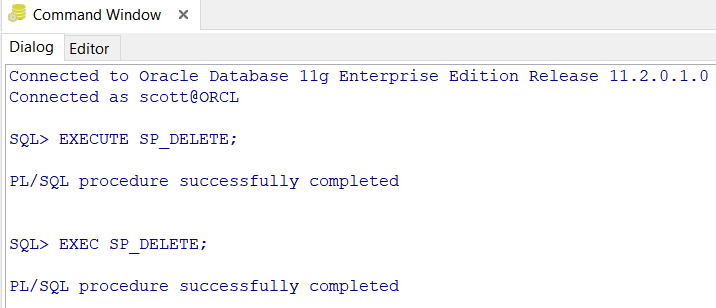
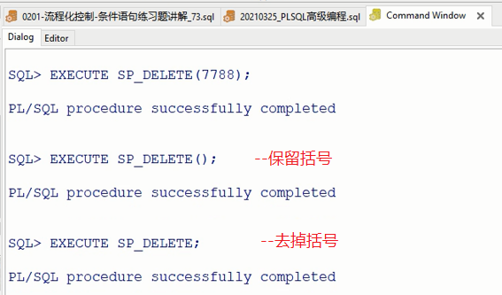
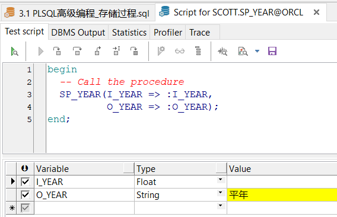

## 存储过程

### 1. 存储过程-创建

```SQL
CREATE[OR REPLACE] PROCEDURE pro_name[(para1,para2...)]
IS|AS
  var_name var_type;
  ...
BEGIN
  plsql_sentence
  EXCEPTION
    except_sentence
END [pro_name] ;
```

- 存储过程的创建语法与**PL/SQL匿名块**的语法基本一致，区别主要在于声明部分。
- 存储过程中没有`DECLARE`关键词，而是`CREATE`和`REPLACE`，前者是创建一个过程，后者是替换一个过程。
- 过程的关键词是`PROCEDURE`。紧随过程名称是过程的参数设置，在这里可以选择设置输入参数或输出参数，也可以选择不设置即没有参数，设置参数时需要指定参数名称和参数的数据类型，不可以指定长度。
- 参数设置后是`IS`或`AS`关键词，一直到`BEGIN`之前，就是正常的过程内变量的设置。


```SQL
--判断一个年份是不是闰年  
--闰年：能被4整除但不能被100整除，或者能被400整除
CREATE OR REPLACE PROCEDURE SP_YEAR(I_YEAR IN NUMBER, O_YEAR OUT VARCHAR2) 
IS
BEGIN
  IF MOD(I_YEAR,4) = 0 AND MOD(I_YEAR,100) <> 0 OR MOD(I_YEAR,400) = 0 THEN
    O_YEAR := '闰年';
  ELSE
    O_YEAR := '平年';
  END IF;
END;
```


### 2. 存储过程-编译

和之前的**PL/SQL匿名块**以及普通的**SQL代码**不同，存储过程的代码写完后点击执行，执行的是“编译”的过程，也就是写入到数据库的过程，并不是真正地调用了程序，编译后的存储过程可以在工具左侧查看过程的编译状态，编译有问题的会出现`×`号。

#### 注意：

- 1）类似于表、索引等对象，过程也是有自己的用户所属；
- 2）过程上带有`×`号的过程不一定真的有问题，可尝试重新编译；
- 3）真正有问题的过程可在**view**或**edit**界面进行原因查看和语法调试。


### 3. 存储过程-执行

　存储过程的执行有多种方法：

- 1）在**SQL WINDOW**中`CALL pro_name(para1,para2..)`执行（其中就算没有参数括号也不能省略）；
- 2）在**COMMAND WINDOW**中使用`EXECUTE pro_name(para1,para2..)`执行；
- 3）在块中直接写`pro_name(para1,para2..)`调用；  --常用于程序自动调用
- 4）直接**TEST**执行存储过程。  --常用于手动调用


```SQL
1）
CALL pro_name();
2）
SQL > EXECUTE pro_name ;
SQL > EXEC pro_name ;
3）
BEGIN
  table_rebuiled_emp;
END;
```


```SQL
CREATE OR REPLACE PROCEDURE SP_DELETE IS
BEGIN
  DELETE FROM EMP WHERE DEPTNO = 10;
  COMMIT;
END;
```


```SQL
CALL SP_DELETE();  --括号不能去掉
```





```SQL
BEGIN 
  SP_DELETE;  --括号可以去掉
END;
```


```SQL
-自动调用
DECLARE
  A VARCHAR2(1000);
BEGIN
  SP_YEAR(2021,A);
  DBMS_OUTPUT.PUT_LINE(A);
END;
```





### 4. 存储过程-参数

参数是一种向程序单元输入和输出数据的机制，参数的存在可以增强存储过程的灵活性。存储过程可以接收多个参数，参数的模式包括`IN`、`OUT`和`IN OUT`三种。

另外之前也区分过，在程序内部写入的参数称为**形参**，在程序调用时调用方写入的参数称为**实参**。实参写入后由形参接收，然后由形参参与程序的执行。

#### 1. 存储过程-IN模式参数

- IN模式参数是一种输入类型的参数，用于接收调用方写入的实参。它是数据库最常见也是默认的一种参数。

  - ```SQL
    CREATE [OR REPLACE] PROCEDURE pro_name (
      i_name1 [IN] data_type DEFAULT def_val,
      i_name2 [IN] data_type DEFAULT def_val,
      ... )
    IS|AS
    ```

- **IN模式参数**在设定时可以**设置默认值**，以供无实参录入时使用。

- PS：**IN参数**只能是存储默认值或调用方传入值，程序运行过程中**IN参数**内容不能修改。


```SQL
/*输入年、月、日转换为对应格式*/
CREATE OR REPLACE PROCEDURE SP_NYR(
  I_YEAR  VARCHAR2,
  I_MONTH VARCHAR2,
  I_DAY   VARCHAR2,
  O_NYR   OUT VARCHAR2) IS
BEGIN
  O_NYR := I_YEAR||'-'||I_MONTH||'-'||I_DAY;
END;
```


#### 2. 存储过程-参数传递方式

- 1）名称传递法：

  - ```SQL
    pro_name (i_namel=>valuel,i_name2=>value2,...)
    ```

- 2）位置传递法：

  - ```SQL
    pro_name (valuel,value2,...)
    ```

- 3）混合传递法：

  - ```SQL
    pro_name (valuel,i_name2=>value2)
    ```

- 注意：

  - 1）只有名称传递才能更改原**参数位置顺序**；
  - 2）混合传递法中但凡某位置用了名称传递，后续都要用名称传递。


```SQL
DECLARE
  B VARCHAR2(10);
BEGIN
/*SP_NYR ('2021','03','25',B);  --位置传递法*/
/*SP_NYR(I_YEAR => '2021',I_MONTH => '03',I_DAY => '25',O_NYR => B);  --名称传递法*/
/*SP_NYR(O_NYR => B,I_YEAR => '2021',I_DAY => '25',I_MONTH => '03');  --名称传递法能更改原参数位置顺序*/
  SP_NYR('2021','03',I_DAY => '25',O_NYR => B);  --混合传递法中但凡某位置用了名称传递，后续都要用名称传递
  DBMS_OUTPUT.PUT_LINE(B);
END;
```


#### 3. 存储过程-OUT模式参数

- **OUT模式参数**是一种输出类型的参数，这个参数在程序调用过程中会被赋予内容，并在调用结束后返回该值。
- 实际项目中，**OUT参数**常常用来返回存储过程的执行状态，比如用`0`表示执行成功，用`1`表示执行失败。其他类型的返回内容往往是在后续将要学到的存储函数中出现。
- **OUT参数**在调用时需要给予相应数量的变量用来接收返回值，所以在调用带有OUT参数的存储过程时，往往是通过**TEST窗口**或者**PL/SQL匿名块**来调用。
- PS：**OUT参数**在声明时必须加上**OUT关键词**，否则会被认作**IN参数**。


#### 4. 存储过程-IN OUT模式参数

- **IN参数**能够用来接收调用方传入的内容，**OUT参数**能够用来接收存储过程返回的内容，二者各司其职、互不干扰，但从某种角度来说，也是造成了参数浪费。而**IN OUT参数**则是结合了两者的优势，它既能在程序调用时用来接收传入的内容，在程序运行过程中也能用来接收返回内容，实现了“一参两用”。

- Ps：

  - **IN OUT参数**在声明时必须加上**IN OUT关键词**，否则会被认作**IN参数**；

  - **IN OUT参数**无论是在输入时还是输出时，都只有一个数据类型。


```SQL
CREATE OR REPLACE PROCEDURE SP_NYR(IO_NYR IN OUT VARCHAR2)
IS
BEGIN
  IO_NYR:='今天是:'||IO_NYR;
END;
```


### 5. 存储过程-删除

语法

```SQL
DROP PROCEDURE pro_name;
```

实际项目中，很少有删除存储过程的情况，一般情况下是直接**替换**掉原本的存储过程，或是干脆**新建**一个存储过程，旧的就不再使用了。

存储过程本身就像一条保存在数据库中的数据，不调用时占用资源很少。

