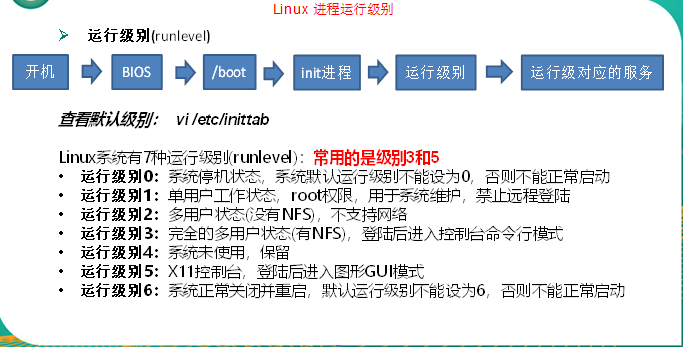

## **服务管理**


空格使用 `\+空格`  表示 

```SHELL
[root@corcl tmp]# ls
New File
[root@corcl tmp]# vi New\ File 
```

通过编辑/etc/hostname文件修改hostname主机名

```SHELL
[root@hadoop100 桌面]# vim /etc/hostname
```

打开/etc/hosts修改hosts文件实现域名指定IP解析

```SHELL
[root@hadoop100 桌面]# vim /etc/hosts
```


### 临时后台服务管理

1.基本语法（CentOS 6）

service  服务名 start			（功能描述：开启服务）

service  服务名 stop			（功能描述：关闭服务）

service  服务名 restart			（功能描述：重新启动服务）

service  服务名 status			（功能描述：查看服务状态）

 

1.基本语法（CentOS 7）

systemctl start	服务名		（功能描述：开启服务）

systemctle  stop	服务名		（功能描述：关闭服务）

systemctl  restart	 服务名		（功能描述：重新启动服务）

systemctl  status	 服务名		（功能描述：查看服务状态）

systemctl  --type  service		（功能描述：查看正在运行的服务）

 

\2. 经验技巧

​	查看服务的方法：/usr/lib/systemd/system

3.案例实操

（1）查看网络服务的状态

[root@hadoop100 桌面]#systemctl status network

（2）停止网络服务

[root@hadoop100 桌面]#systemctl stop network

（3）启动网络服务

[root@hadoop100 桌面]#systemctl start network

（4）重启网络服务

[root@hadoop100 桌面]#systemctl restart network

### **5.4.2 设置后台服务的自启配置**

\1. ***\*基本语法\*******\*（Cent\*******\*OS 6\*******\*）\****

chkconfig  			 （功能描述：查看所有服务器自启配置）

chkconfig 服务名 off  （功能描述：关掉指定服务的自动启动）

chkconfig 服务名 on  （功能描述：开启指定服务的自动启动）

chkconfig 服务名 --list	（功能描述：查看服务开机启动状态）

 

\1. **基本语法****（Cent****OS 7****）**

systemctl  list-unit-files  （功能描述：查看所有服务器自启配置）

systemctl  disable 服务名  （功能描述：关掉指定服务的自动启动）

systemctl  enable  服务名  （功能描述：开启指定服务的自动启动）

systemctl  is-enabled 服务名（功能描述：查看服务开机启动状态）

\2. ***\*案例实操\****

（1）关闭防火墙的自动启动

[root@hadoop100 桌面]#system disable firewalld

（2）开启防火墙的自动启动

[root@hadoop100 桌面]#system enable firewalld

（3）查看防火墙状态

[root@hadoop100桌面]#systemctl is-enabled firewalld

### **5.4.3** **进程运行****级别**

Linux进程运行级别

 


## **5.5 关机重启命令**

在linux领域内大多用在服务器上，很少遇到关机的操作。毕竟服务器上跑一个服务是永无止境的，除非特殊情况下，不得已才会关机。

**正确的关机流程为**：sync > shutdown > reboot >poweroff

\1. 基本语法

​	（1）sync  		（功能描述：将数据由内存同步到硬盘中）

（2）poweroff			（功能描述：关闭系统，等同于shutdown -h now）

（3）reboot 			（功能描述：就是重启，等同于 shutdown -r now）

​	（4）shutdown [选项] 时间	

表1-4

| 选项 | 功能          |
| ---- | ------------- |
| -h   | -h=halt关机   |
| -r   | -r=reboot重启 |

表1-5

| 参数 | 功能                                   |
| ---- | -------------------------------------- |
| now  | 立刻关机                               |
| 时间 | 等待多久后关机（时间单位是**分钟**）。 |

\2. 经验技巧

​	Linux系统中为了提高磁盘的读写效率，对磁盘采取了 “预读迟写”操作方式。当用户保存文件时，Linux核心并不一定立即将保存数据写入物理磁盘中，而是将数据保存在缓冲区中，等缓冲区满时再写入磁盘，这种方式可以极大的提高磁盘写入数据的效率。但是，也带来了安全隐患，如果数据还未写入磁盘时，系统掉电或者其他严重问题出现，则将导致数据丢失。使用sync指令可以立即将缓冲区的数据写入磁盘。

3．案例实操

（1）将数据由内存同步到硬盘中

[root@hadoop100桌面]#sync  

（2）重启

[root@hadoop100桌面]# reboot 

（3）关机

[root@hadoop100桌面]#poweroff 

（4）计算机将在1分钟后关机，并且会显示在登录用户的当前屏幕中

[root@hadoop100桌面]#shutdown -h 1 ‘This server will shutdown after 1 mins’

（5）立马关机（等同于 halt）

[root@hadoop100桌面]# shutdown -h now 

（6）系统立马重启（等同于 reboot）

[root@hadoop100桌面]# shutdown -r now