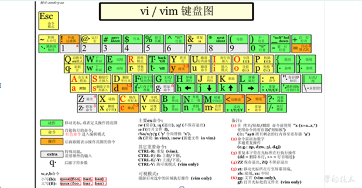
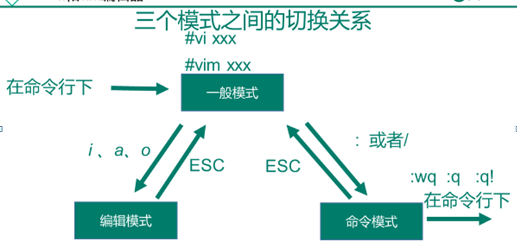

### 文本操作命令

#### 1）VI/VIM编辑器

vi /PATH/不存在的文件 保存后会直接新建该文件

```SHELL
#拷贝 /etc/passwd 文件到 /root 目录
cp /etc/passwd /root
#切换到 /root 目录
cd /root/
#使用VI编辑器打开 /root/passwd 文件（下列3种方式均可）
##绝对路径
vi /root/passwd
##相对路径
vi ./passwd
vi passwd
```

vi编辑器一般模式(默认模式)

以vi/vim打开一个档案就直接进入一般模式了（这是**默认的模式**）。在这个模式中， 你可以使用『上下左右』按键来移动光标，你可以使用『删除字符』或『删除整行』来处理档案内容， 也可以使用『复制、贴上』来处理你的文件数据。

| 语法                        | 功能描述                              |
| --------------------------- | ------------------------------------- |
| yy                          | **复制**光标当前一行                  |
| y数字y                      | 复制一段（从第几行到第几行）          |
| p                           | 箭头移动到目的行**粘贴**              |
| u                           | **撤销上一步**                        |
| dd                          | **删除**光标当前行                    |
| d数字d                      | 删除光标（含）后多少行                |
| x                           | 删除一个字母，相当于del，**向后删**   |
| X                           | 删除一个字母，相当于Backspace，向前删 |
| yw                          | 复制一个词                            |
| dw                          | 删除一个词                            |
| ^                           | **移动到行头**                        |
| $                           | **移动到行尾**                        |
| gg或者1+G                   | **移动到页头**                        |
| G                           | **移动到页尾**                        |
| 数字+G（先输入数字，在按G） | **移动到目标行**                      |




```SHELL
#非编辑模式

方向键可以改变光标在文件中的位置

Ctrl+F:向下翻页

Ctrl+B:向上翻页

/要查找的内容：可以在文件中查找字符串内容,向后查找

?要查找的内容：向前查找

dd:删除光标当前行内容

u:是撤销

yy:复制一行内容到剪切版

p:将剪切中的内容粘贴到光标当前行的下一行

:set nu #显示整个文档的行号

:set nonu #去掉行号显示

:s/原文件内容/新的内容 #将光标当前行的内容进行替换，只替换该行第一个出现的所谓原内容

:s/原文件内容/新的内容/gi #将光标当前行的内容进行替换  其中g表示全部， i表示忽略大小写 

:%s/原文件内容/新的内容/gi  #全文替换

:n1,n2s/原文件内容/新的文件内容/gi #n1,n2表示行号(直接写数字)，替换指定行范围中的内容

$:让光标到当前行的最后

^:光标移到行首

:w 保存文件

:q 退出vim命令，不保存 --

:wq 保存并退出vi命令 --

:w! 强制保存

:q! 强制退出，不保存 --

:wq! 强制保存并退出

:set ff查看文件格式（unix和dos 另外还有mac格式）
```


编辑模式

在一般模式中可以进行删除、复制、粘贴等的动作，但是无法编辑文件内容！要等到你按下『i, I, o, O, a, A』等任何一个字母之后才会进入编辑模式。

注意了！通常在Linux中，按下这些按键时，在画面的左下方会出现『INSERT或 REPLACE』的字样，此时才可以进行编辑。而如果要回到一般模式时， 则必须要按下『Esc』这个按键即可退出编辑模式。

1．进入编辑模式

| 按键 | 功能                   |
| ---- | ---------------------- |
| i    | **当前光标前**         |
| a    | 当前光标后             |
| o    | **当前光标行的下一行** |
| I    | 光标所在行最前         |
| A    | 光标所在行最后         |
| O    | 当前光标行的上一行     |

2．退出编辑模式

按『Esc』键

```SHELL
i进入编辑模式，光标在当前行
o进入编辑模式，光标在当前行的下一行（创建一个新行）

ESC退出编辑模式
```

命令模式

**在一般模式当中**，输入『 **: / ?**』3个中的任何一个按钮，就可以将光标移动到最底下那一行。

在这个模式当中， 可以提供你『搜寻资料』的动作，而读取、存盘、大量取代字符、离开 vi 、显示行号等动作是在此模式中达成的！

1．基本语法

| 命令                                          | 功能                                                         |
| --------------------------------------------- | ------------------------------------------------------------ |
| :w                                            | **保存**                                                     |
| :q                                            | **退出**                                                     |
| :!                                            | **强制执行**                                                 |
| : %s/源字符串/目的字符串/g(:%s/games/youxi/g) | **批量替换**                                                 |
| / 要查找的词                                  | n 查找下一个，N 往上查找                                     |
| ? 要查找的词                                  | n是查找上一个，N是往下查找                                   |
| :set nu                                       | 显示行号                                                     |
| :set nonu                                     | 关闭行号                                                     |
| ZZ（shift+zz） :nohl                          | **没有修改文件直接退出，如果修改了文件保存后退****去除高亮显示** |

2．案例实操

（1）强制保存退出

**:wq!**


模式间转换





#### 2）file #查看文件类型

file path|filename

```SHELL
[root@corcl ~]# cd /tmp
[root@corcl tmp]# ls
ks-script-CyTZpl  systemd-private-dbece319456e4a9fa2ddb7b870b1bfc0-chronyd.service-1tPKoG  yum.log
#空文本文件
[root@corcl tmp]# file yum.log 
yum.log: empty
#文本文件
[root@corcl tmp]# file ks-script-CyTZpl 
ks-script-CyTZpl: ASCII text
[root@corcl tmp]# file systemd-private-dbece319456e4a9fa2ddb7b870b1bfc0-chronyd.service-1tPKoG/
#目录
systemd-private-dbece319456e4a9fa2ddb7b870b1bfc0-chronyd.service-1tPKoG/: directory
[root@corcl tmp]# 
```


#### 3）查看整个文件内容

cat #完整查看文件 内容

cat path/filename 查看文件filename中的内容，可在文件前指定路径

more #分页查看文件内容，空格或者回车向下翻页

查看文件内容并显示行号

 cat -n houge.txt 


more path/filename

| 操作           | 功能说明                                 |
| -------------- | ---------------------------------------- |
| 空白键 (space) | 代表向下翻一页；                         |
| Enter          | 代表向下翻『一行』；                     |
| q              | 代表立刻离开 more ，不再显示该文件内容。 |
| Ctrl+F         | 向下滚动一屏                             |
| Ctrl+B         | 返回上一屏                               |
| =              | 输出当前行的行号                         |
| :f             | 输出文件名和当前行的行号                 |

less #分页查看文件内容，空格或回车向下翻页（退出时需要输入q）

less path/filename

| 操作       | 功能说明                                           |
| ---------- | -------------------------------------------------- |
| 空白键     | 向下翻动一页；                                     |
| [pagedown] | 向下翻动一页                                       |
| [pageup]   | 向上翻动一页；                                     |
| /字串      | 向下搜寻『字串』的功能；n：向下查找；N：向上查找； |
| ?字串      | 向上搜寻『字串』的功能；n：向上查找；N：向下查找； |
| q          | 离开 less 这个程序；                               |

#### 4）查看部分文件内容

head #从文件的开始位置查看文件的若干行

head [-n] path/filename:n是一个正整数，表示查看文件的前n行数据

 head用于显示文件的开头部分内容，默认情况下head指令显示文件的前10行内容。

head 文件名	   （功能描述：查看文件头10行内容）

head -n 5 文件名    （功能描述：查看文件头5行内容，5可以是任意行数）


tail #从文件的末尾查看文件若干行

（1）tail  文件 			（功能描述：查看文件后10行内容）

（2）tail  -n 5 文件 		（功能描述：查看文件后5行内容，5可以是任意行数）

（3）tail  -f  文件		（功能描述：实时追踪该文档的所有更新）

Ctrl+C 退出查看

Ctrl+Z 暂停程序

```
[root@corcl tmp]# head -3 New\ File 
11
1
1
[root@corcl tmp]# tail -3 New\ File 
1
1
11
[root@corcl tmp]# 
```


###  **>** **覆盖** **和 >> 追加**

1．基本语法

（1）ll >文件		（功能描述：列表的内容写入文件a.txt中（**覆盖写**））

（2）ll >>文件		（功能描述：列表的内容**追加**到文件aa.txt的末尾）

（3）cat 文件1 > 文件2	（功能描述：将文件1的内容覆盖到文件2）

（4）echo “内容” >> 文件


案例实操

（1）将ls查看信息写入到文件中

[root@hadoop101 ~]# ls -l>houge.txt

（2）将ls查看信息追加到文件中

[root@hadoop101 ~]# ls -l>>houge.txt

（3）采用echo将hello单词追加到文件中

[root@hadoop101 ~]# echo hello>>houge.txt


### ln - 新建链接

ln 用于创建软或硬链接。

| 参数 | 作用                                         |
| ---- | -------------------------------------------- |
| -s   | 创建软链接(如果不带 -s 参数，默认创建硬链接) |
| -f   | 强制创建文件或目录的链接                     |
| -i   | 覆盖前先询问                                 |
| -v   | 显示创建链接的过程                           |

软链接也成为符号链接，类似于windows里的快捷方式，有自己的数据块，主要存放了链接其他文件的路径。

1．基本语法

ln -s [原文件或目录] [软链接名]		（功能描述：给原文件创建一个软链接）

2．经验技巧

删除软链接： rm -rf 软链接名，而不是rm -rf 软链接名/

查询：通过ll就可以查看，列表属性第1位是l，尾部会有位置指向。


3．案例实操

​	（1）创建软连接

[root@hadoop101 ~]# mv houge.txt xiyou/dssz/

[root@hadoop101 ~]# ln -s xiyou/dssz/houge.txt ./houzi

[root@hadoop101 ~]# ll

lrwxrwxrwx. 1 root   root    20 6月  17 12:56 houzi -> xiyou/dssz/houge.txt

（2）删除软连接

[root@hadoop101 ~]# rm -rf houzi

（3）进入软连接实际物理路径

[root@hadoop101 ~]# ln -s xiyou/dssz/ ./dssz

[root@hadoop101 ~]# cd -P dssz/


ln命令可以生成软链接和硬链接，也可叫做符号链接和实体链接。 有兴趣深入理解的可以查阅相关文档，一般的读者只需记住以下几点即可：

1. 不管是软链接还是硬链接都不会额外增加磁盘空间(虽然实际情况可能会多占用1个block)
2. 软链接会占用1个inode，而硬链接不占用inode(想深究的可以自行查阅，不深究的可以直接略过)
3. 硬链接不能跨文件系统，不能链接目录(可以得出软链接是可以的)。

**硬链接：**假设在当前目录有文件名为linuxidc.jpg(大小为1M)，现在为它创建硬链接linuxidc-h.jpg，那么当前目录就有了2个文件，这2个文件除了名字不一样其他的一模一样，但是占用的实际磁盘空间还是只有1M，改变任何一个文件的内容另一个文件也会跟着改变；
当你只删除linuxidc.jpg或只删除linuxidc-h.jpg时，文件内容都还在磁盘，只有同时删除了这2个文件时才会真的彻底删除该1M的占用。

**软链接：**假设在当前目录有文件名为linuxidc.jpg(大小为1M)，现在为它创建软链接linuxidc-s.jpg，那么当前目录就有了2个文件，linuxidc-s.jpg是一个全新的文件大小为7bytes(等于linuxidc.jpg名称占用的字节数)，它指向linuxidc.jpg(学过C语言的指针理解起来会很快)；
改变任何一个文件的内容另一个文件也会跟着改变，删除linuxidc-s.jpg不影响linuxidc.jpg，但是删除了linuxidc.jpg那么tmp-s.jpg就会失效因为它找不到它指向的文件了 。

\###bash###
\#常用命令选项
\#默认硬链接
-s   #软链接
-f   #如果目标文件存在时，直接移除后再创建(危险)

###bash###
\#假设文件夹aaa下有10个文件
ln -s aaa bbb #生成aaa的软链接bbb

\#未来有一天当你想要删除软链接bbb
\#只要敲如下命令
rm -f bbb

\#千万别大意敲如下命令，这样会把aaa里面的10个文件删除掉
rm -rf bbb/ #在使用软连接过程中，请使用绝对路径，如果使用了想对路径，可能会出现连接数过多错误。


cp -l 源文件 目标文件   硬链接

cp -s 源文件 目标文件   符号链接

cp -r 源路径 目标路径   递归复制


history 查看已经执行过历史命令


### **date 显示当前时间**

1．基本语法

​	（1）date								（功能描述：显示当前时间）

​	（2）date +%Y							（功能描述：显示当前年份）

（3）date +%m							（功能描述：显示当前月份）

（4）date +%d							（功能描述：显示当前是哪一天）

​	（5）date "+%Y-%m-%d %H:%M:%S"		（功能描述：显示年月日时分秒）

2．案例实操

（1）显示当前时间信息

[root@hadoop101 ~]# date

2017年 06月 19日 星期一 20:53:30 CST

（2）显示当前时间年月日

[root@hadoop101 ~]# date +%Y%m%d

20170619

（3）显示当前时间年月日时分秒

[root@hadoop101 ~]# date "+%Y-%m-%d %H:%M:%S"

2017-06-19 20:54:58

### **7.3.2 date 显示非当前时间**

1．基本语法

（1）date -d '1 days ago'			（功能描述：显示前一天时间）

（2）date -d '-1 days ago'			（功能描述：显示明天时间）

2．案例实操

（1）显示前一天

[root@hadoop101 ~]# date -d '1 days ago'

2017年 06月 18日 星期日 21:07:22 CST

（2）显示明天时间

[root@hadoop101 ~]#date -d '-1 days ago'

2017年 06月 20日 星期日 21:07:22 CST

### **7.3.3 date 设置系统时间**

1．基本语法

​	date -s 字符串时间

2．案例实操

​	（1）设置系统当前时间

[root@hadoop101 ~]# date -s "2017-06-19 20:52:18"

### **7.3.4 cal 查看日历**

1．基本语法

cal [选项]			（功能描述：不加选项，显示本月日历）

2．选项说明

表1-22

| 选项       | 功能             |
| ---------- | ---------------- |
| 具体某一年 | 显示这一年的日历 |

3．案例实操

（1）查看当前月的日历

[root@hadoop101 ~]# cal

（2）查看2017年的日历

[root@hadoop101 ~]# cal 2017

 


#### 5）sort #文件内容排序

默认情况下会以字符为排序标准，若想以数值排序，需加-n参数

  

#### 6）搜索

grep #搜索符合的行

grep str filename 从文件中找到含有str的行

 -v 改为查找不含str的行

 -n 显示符合要求的行的行号

 -c 显示符合要求的行的数量

 -e 添加多个要求 也可使用[]

 -E 'str1.*str2'


find #搜索符合的文件或目录

find [/path] -name xxx 从目录（若未指定则为当前目录）中找到名为xxx的文件或目录

find -type f 显示当前目录及子目录中的普通文件

 　　-type d 显示当前目录及子目录中的路径

| 选项            | 功能                             |
| --------------- | -------------------------------- |
| -name<查询方式> | 按照指定的文件名查找模式查找文件 |
| -user<用户名>   | 查找属于指定用户名所有文件       |
| -size<文件大小> | 按照指定的文件大小查找文件。     |

```SHELL
# find -type f 与 ll -R、ls -R 的区别
[root@xuliu home]# find -type f
./ac/cc.tar
./ac/hello2.py
./ac/acc.tar.gz
./a.txt
./b.txt
./c.txt
./.text.txt.swp
./text.sql
./cal.txt
./dd.txt
[root@xuliu home]# ll -R
.:
总用量 24
drwxr-xr-x. 2 root root    55 3月   2 11:06 ac
-rw-r--r--. 1 root root 10240 3月   2 09:10 a.txt
-rw-r--r--. 1 root root     0 3月   2 09:01 b.txt
-rw-r--r--. 1 root root  2073 3月   2 15:51 cal.txt
-rw-r--r--. 1 root root     0 3月   2 09:01 c.txt
-rw-r--r--. 1 root root    18 3月   2 16:08 dd.txt
-rw-r--r--. 1 root root   240 3月   2 10:53 text.sql

./ac:
总用量 28
-rw-r--r--. 1 root root   158 3月   2 09:18 acc.tar.gz
-rw-r--r--. 1 root root 20480 3月   2 09:12 cc.tar
-rw-r--r--. 1 root root    20 2月  28 21:00 hello2.py
[root@xuliu home]# ll -a
总用量 36
drwxr-xr-x.  3 root root   121 3月   2 16:08 .
dr-xr-xr-x. 17 root root   224 3月   2 09:47 ..
drwxr-xr-x.  2 root root    55 3月   2 11:06 ac
-rw-r--r--.  1 root root 10240 3月   2 09:10 a.txt
-rw-r--r--.  1 root root     0 3月   2 09:01 b.txt
-rw-r--r--.  1 root root  2073 3月   2 15:51 cal.txt
-rw-r--r--.  1 root root     0 3月   2 09:01 c.txt
-rw-r--r--.  1 root root    18 3月   2 16:08 dd.txt
-rw-r--r--.  1 root root   240 3月   2 10:53 text.sql
-rw-r--r--.  1 root root 12288 3月   2 15:01 .text.txt.swp
[root@xuliu home]# ls -R
.:
ac  a.txt  b.txt  cal.txt  c.txt  dd.txt  text.sql

./ac:
acc.tar.gz  cc.tar  hello2.py
[root@xuliu home]# 
```

### **which** **查找命令**

​	查找命令在那个目录下

1．基本语法

which 命令

2．案例实操

which ll

#### 7）printf #打印

printf '格式字符串' 文本内容或文件

 %s：字符串  \n 换行

 %n：数字

 %m.nf：表示小数，其中m是总长度 n是小数精度

printf '%s %s\n' 1 2 3 4 5 6

printf '(%s)\n' 1 2 3 

常用转义字符：

\n 换行

\r 回车

\t 水平制表符

\v 垂直制表符

\\ 表示\本身

```SHELL
[root@corcl home]# printf '%s %s\n' 1 2 3 4 5 6
1 2
3 4
5 6
[root@corcl home]# printf '(%s)\n' 1 2 3 
(1)
(2)
(3)
[root@corcl home]# 
```


#### 8）wc #计数（word count）

wc filename 查看指定文件的单词数、行数和大小

 -w 查看单词数

 -l 查看行数

 -c 查看字节数

 -m 查看字符数

 

#### 9）cut #截取

cut -f n -d '分隔符' filename

 -f 指定被截取的列 

 -d 指定以何种符号判定列与列的分隔 默认为一个tab键(\t)

 

#### 10）sed #流编辑器

一行数据→经过sed指令处理→一行新数据 

参数：

 -e 添加多种指令，每个''前添加 -e 参数

 -f 指定指令文件 可跟一个.sed文件  将某条或多条指令放入

 -n 显示处理结果

 -i 使编辑指令作用到文件 

指令：

 nd 删除 n为正整数，将第n行删除

 s  替换 后跟替换格式，和之前vi编辑器中差不多

 np 打印 n为正整数，将第n行打印 通常和-n参数使用

 ni 添加 后跟字符串，n为正整数，在第n行之前添加内容

 na 添加 后跟字符串，n为正整数，在第n行之后添加内容

 

sed 's/xxx/yyy/' filename 将文件中每一行的xxx替换为yyy显示  --不用再加%

sed '2p' filename 将文件中的第二行额外打印 添加-n后只有第二行打印

sed xxx.sed filename 将文件按照xxx.sed中的指令处理

 

#### 11）awk #文本分析

awk - 行匹配语句

awk '{printf $1 $2}' filename 获取文件中第1和第2列的内容打印，且不换行

awk '{print $1 $2}' filename  获取文件中第1和第2列的内容打印，且换行

awk '{print $1 "," $2}' filename  指定以,为分隔符显示分析结果

awk -F, '{print $1 $2}' filename  指定以,为分隔符分隔文件内容
