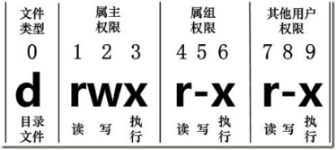
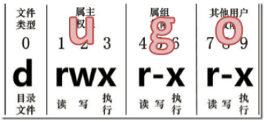

##用户及权限管理

1）用户相关

id 查看用户是否存在

cat  /etc/passwd 查看创建了哪些用户

su 用户名称  （功能描述：切换用户，只能获得用户的执行权限，不能获得环境变量）

su - 用户名称		（功能描述：切换到用户并获得该用户的环境变量及执行权限）

useradd - 添加用户 

 -d 默认会在 /home 目录下为用户创建同名的主目录，通过- d 可指定主目录 另若该目录不存在，建议加上 -m

 -g 指定用户所属的用户组

 -G 指定用户所属的附加组 在对应用户登录状态下使用groups命令可返回该用户属组信息

  （用户可归属多个用户组，其中通过-g 指定的为主组，-G指定的为附加组，以,分隔）

 

（1）userdel  用户名		（功能描述：删除用户但保存用户主目录）

（2）userdel -r 用户名		（功能描述：用户和用户主目录，都删除）

usermod - 修改用户

 修改参数如useradd

 usermod -g 用户组 用户名(修改用户所属组)

usermod -G 用户组 用户名(追加用户附属组)

passwd  - 修改密码

passwd user 输入两次密码确认

userdel 删除用户

（1）userdel  用户名		（功能描述：删除用户但保存用户主目录）

（2）userdel -r 用户名		（功能描述：用户和用户主目录，都删除）

 

su: swith user 切换用户

su 用户名称  （功能描述：切换用户，只能获得用户的执行权限，不能获得环境变量）

su - 用户名称		（功能描述：切换到用户并获得该用户的环境变量及执行权限）

 

who - 查看登录系统的用户

whoami - 查看当前用户

（1）whoami			（功能描述：显示自身用户名称）

（2）who am i		（功能描述：显示**登录用户**的用户名）

 **sudo** **设置普通用户具有root权限**

1．添加houge用户，并对其设置密码。

[root@hadoop101 ~]#useradd houge

[root@hadoop101 ~]#passwd houge

2．修改配置文件

[root@hadoop101 ~]#vi /etc/sudoers

修改 /etc/sudoers 文件，找到下面一行(91行)，在root下面添加一行，如下所示：

\## Allow root to run any commands anywhere

root   ALL=(ALL)   ALL

houge  ALL=(ALL)   ALL

或者配置成采用sudo命令时，不需要输入密码

\## Allow root to run any commands anywhere

root    ALL=(ALL)   ALL

houge  ALL=(ALL)   NOPASSWD:ALL

修改完毕，现在可以用houge帐号登录，然后用命令 sudo ，即可获得root权限进行操作。

2）组相关

每个用户都有一个用户组，系统可以对一个用户组中的所有用户进行集中管理。不同Linux 系统对用户组的规定有所不同，

如Linux下的用户属于与它同名的用户组，这个用户组在创建用户时同时创建。

用户组的管理涉及用户组的添加、删除和修改。组的增加、删除和修改实际上就是对/etc/group文件的更新。

groupadd - 添加组

groupadd 组名

 

groupdel - 删除组

groupdel 组名

groupmod - 修改组

groupmod -n 新组名 老组名

cat  /etc/group 查看创建了哪些组

文件权限类

文件属性

Linux系统是一种典型的多用户系统，不同的用户处于不同的地位，拥有不同的权限。为了保护系统的安全性，Linux系统对不同的用户访问同一文件（包括目录文件）的权限做了不同的规定。在Linux中我们可以使用ll或者ls -l命令来显示一个文件的属性以及文件所属的用户和组。

如果没有权限，就会出现减号[ - ]而已。从左至右用0-9这些数字来表示:

（1）0首位表示类型

在Linux中第一个字符代表这个文件是目录、文件或链接文件等等

\- 代表文件

 d 代表目录

 l 链接文档(link file)；

（2）第1-3位确定属主（该文件的所有者）拥有该文件的权限。---User

（3）第4-6位确定属组（所有者的同组用户）拥有该文件的权限，---Group

（4）第7-9位确定其他用户拥有该文件的权限 ---Other

rxw作用文件和目录的不同解释

（1）作用到文件：

[ r ]代表可读(read): 可以读取，查看

[ w ]代表可写(write): 可以修改，但是不代表可以删除该文件，删除一个文件的前提条件是对该文件所在的目录有写权限，才能删除该文件.

[ x ]代表可执行(execute):可以被系统执行

（2）作用到目录：

[ r ]代表可读(read): 可以读取，ls查看目录内容

[ w ]代表可写(write): 可以修改，目录内创建+删除+重命名目录

[ x ]代表可执行(execute):可以进入该目录

3）权限和所属

chmod - 改变权限

 -R 当对象为目录时，改变目录及目录下所有子内容权限

r:4

w:2

x:1

777  #rwxrwxrwx

775  #rwxrwxr-x

755  #rwxr-xr-x

766  #rwxrw-rw-

644  #rw-r--r--

 

二进制 权限  

000   ---   0

001   --x   1

010   -w-   2

011   -wx   3

100   r--   4

101   r-x   5

110   rw-   6

111   rwx   7

 

十进制：0 1 2 3 4 5 。。9 

20

二进制

111

 第一种方式变更权限

​		chmod  [{ugoa}{+-=}{rwx}] 文件或目录

第二种方式变更权限

​	chmod  [mode=421 ]  [文件或目录]

经验技巧

​	u:所有者  g:所有组  o:其他人  a:所有人(u、g、o的总和)

r=4 w=2 x=1     rwx=4+2+1=7

案例实操

（1）修改文件使其所属主用户具有执行权限

[root@hadoop101 ~]# cp xiyou/dssz/houge.txt ./

[root@hadoop101 ~]# chmod u+x houge.txt

（2）修改文件使其所属组用户具有执行权限

[root@hadoop101 ~]# chmod g+x houge.txt

（3）修改文件所属主用户执行权限,并使其他用户具有执行权限

[root@hadoop101 ~]# chmod u-x,o+x houge.txt

（4）采用数字的方式，设置文件所有者、所属组、其他用户都具有可读可写可执行权限。

[root@hadoop101 ~]# chmod 777 houge.txt

（5）修改整个文件夹里面的所有文件的所有者、所属组、其他用户都具有可读可写可执行权限。

[root@hadoop101 ~]# chmod -R 777 xiyou/

### **chown 改变所有者**

chown [选项] [最终用户] [文件或目录]		（功能描述：改变文件或者目录的所有者）

chown user filename 改变属主

chown user:group filename 改变属组

 -R 当对象为目录时，改变目录及目录下所有子内容所属

chgrp 改变所属组

​	chgrp [最终用户组] [文件或目录]	（功能描述：改变文件或者目录的所属组）

