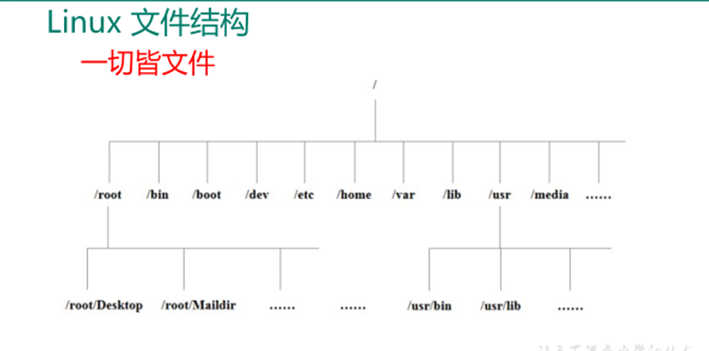
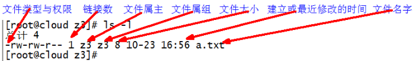
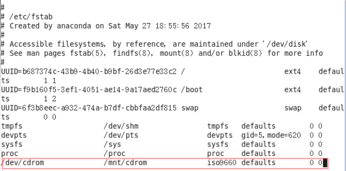

# LINUX

空格使用 `\+空格`  表示 

```SHELL
[root@corcl tmp]# ls
New File
[root@corcl tmp]# vi New\ File 
```

通过编辑 /etc/hostname 文件修改 hostname 主机名


## 1. Linux目录结构





#### /bin ★　　(/usr/bin 、/usr/local/bin)

是**Binary**的缩写,这个目录存放着最经常使用的命令

#### /sbin　　 (/usr/sbin 、/usr/local/sbin)

**s**就是**Super User**的意思，这里存放的是系统管理员使用的系统管
理程序。

#### /home ★

存放普通用户的主目录，在**Linux**中每个用户都有一个自己的目
录，一般该目录名是以用户的账号命名的。

#### /root ★

该目录为系统管理员，也称作超级权限者的用户主目录。

#### /lib

系统开机所需要最基本的动态连接共享库，其作用类似于**Windows**里的**DLL**文件。几乎所有的应用程序都需要用到这些共享库。

#### /lost+found

这个目录一般情况下是空的，当系统非法关机后，这里就存放
了一些文件。

#### /etc ★

所有的系统管理所需要的配置文件和子目录

#### /usr ★

这是一个非常重要的目录，用户的很多应用程序和文件都放在这个目录下，类似与**Windows**下的**Program files**目录。

#### /boot ★

这里存放的是启动**Linux**时使用的一些核心文件，包括一些连接
文件以及镜像文件，自己的安装别放这里

#### /proc

这个目录是一个虚拟的目录，它是系统内存的映射，我们可以
通过直接访问这个目录来获取系统信息。

#### /srv

**service**缩写，该目录存放一些服务启动之后需要提取的数据。

#### /sys

这是**linux2.6内核**的一个很大的变化。该目录下安装了**2.6内核**中新出现的一个文件系统**sysfs**。

#### /tmp

这个目录是用来存放一些临时文件的。

#### /dev ★

类似于**Windows**的设备管理器，把所有的硬件用文件的形式存储。

#### /media  (centos6) ★

**Linux**系统会自动识别一些设备，例如U盘、光驱等等，当识别后，
**Linux**会把识别的设备挂载到这个目录下。

#### /run ★

进程产生的临时文件，虚拟机加载光盘映像在：`/run/media/root/`目录下

#### /mnt

系统提供该目录是为了让用户临时挂载别的文件系统的，我们可以将外部的存储挂载在`/mnt/`上，然后进入该目录就可以查看里的内容了。

#### /opt ★

这是给主机额外安装软件所摆放的目录。比如你安装一个**ORACLE**数据库则就可以放到这个目录下。默认是空的。

#### /usr/local ★

这是另一个给主机额外安装软件所摆放的目录。一般是通过编译源码方式安装的程序。

#### /var ★

这个目录中存放着在不断扩充着的东西，我们习惯将那些经常被修改的目录放在这个目录下。包括各种日志文件。


## 2. 目录操作

### 1. 浏览目录/切换当前所在目录

#### 1. cd #切换路径  change directory

**绝对路径**：从系统根目录开始描述的目录或文件路径称为绝对路径

**相对路径**：从非系统根目录（通常为当前位置）开始描述的其他目录或文件路径称为相对路径。

除非在路径开头加/，默认切换路径都是以当前目录为起始的相对路径。

常用的快捷切换：

```SHELL
cd /     #切换到根目录
cd ~     #切换到用户主目录
cd .     #切换到当前目录
cd ..    #切换到上一级目录
```

#### 2. pwd #获取当路径描述（返回绝对路径）print working directory

该命令常用于确认当前路径是否符合要求，或是在shell脚本中用于获取当前路径的绝对路径。

例子：

```SHELL
#切换到根目录
cd /
#切换到 /home/user 目录
cd /home/user
#当前在/home 切换到 /home/user 目录
cd user
cd ./user
```


#### 3. ls #显示路径下的内容（包括文件或下一级路径）list

Linux命令行下，各个路径的内容需要发出指令才会显示内容，不像Windows系统，一旦进入到文件夹，文件夹中有什么内容会直接显示

```SHELL
ls     #默认显示当前路径下的普通文件（一些隐藏文件不会显示）
ls -l  #显示路径下各目录或文件的详细信息，可简写为ll （注意，不是所有的Linux版本都可以简化该命令）
ls -lh #h参数可以是文件大小以合适的格式显示，而不是固执地以字节为单位显示。可简写为ll -h
ls -a  #显示路径下的所有内容（包括普通文件和一些以.开头的隐藏文件），例如用户主目录下的.bash_profile文件，用于环境配置。（注意，隐藏文件不要随便修改、移动、删除）
ls -R  #显示当前目录下包含的子目录中的文件
```

，详细内容如图：



```SHELL
ls filename #显示某项文件或目录的信息，filename中添加通配符来构成文字扩展匹配：
   ?        #代表1个字符
   *        #代表0个或多个字符
   [ae]     #代表含有a字符或e字符
   [a-e]    #代表含有a字符到e字符中的任意一个
   [!a]     #代表不含a字母  --或[^a]
   tab键   #自动补全
```


#### 4. 目录及文件操作

##### 1）mkdir  #创建（空）目录

```SHELL
mkdir dir            #在当前路径下创建目录dir（默认情况下，mkdir创建目录时，必须存在父目录，即不能递归创建）
mkdir -p dir_a/dir_b #在当前路径下创建目录dir_a，并且在dir_a目录下创建dir_b
mkdir /path/dir_a    #在指定路径下创建目录dir_a
```

　例：

```SHELL
[root@corcl user]# mkdir /home/user/test
[root@corcl user]# ls -lh  /home/user
总用量 0
drwxr-xr-x. 2 root root 6 3月   1 18:35 test
###非递归创建文件夹
[root@corcl user]# mkdir /home/user1/test
mkdir: 无法创建目录"home/user1/test": 没有那个文件或目录
###递归创建文件夹
[root@corcl user]# mkdir -p /home/user1/test
[root@corcl user]# ls -lh /home/user1
总用量 0
drwxr-xr-x. 2 root root 6 3月   1 18:38 test
[root@corcl user]# 
```

##### 2）touch  #创建（空）文件

```SHELL
touch filename       #在当前路径下创建文件（记得添加后缀）
touch /path/filename #在指定路径下创建文件
touch old_filename   #修改源文件的修改时间
```

##### 3）rm  #移除（即删除）文件 

```SHELL
rm filename               #删除当前路径下的指定文件，会询问确认
rm -f filename            #强制删除当前路径下的指定文件，不会询问 
rm -rf /path/filename|dir #递归删除
```

**！！！慎用移除命令：删除时必须指定删除的内容，传说中删天删地删空气，运行之后就准备跑路的命令就是它。**

> 举例：通过变量来组成删除命令，删除指定路径下的所有内容
>
> 正常：变量：var=/home 代码：rm -rf /home/*
>
> 异常：变量：var获取失败 代码：rm -rf /*
>

##### 4）rmdir  #删除目录

rmdir dir #删除某目录 由于rm既可以删除目录又可以删除文件，习惯上是以rm来删除目录

##### 5）cp  #本地文件或路径拷贝（复制）

```SHELL
cp old_path/old_filename new_path/new_filename
cp -r   #可以拷贝目录和目录下的所有文件(递归复制)
cp -l   #硬链接
cp -s   #符号链接
/bin/cp #可以覆盖复制，可以加-rf参数
```

##### 6）mv #移动或重命名文件

```SHELL
mv old_path/filename new_path/new_filename    #将某个文件从旧路径移动到新路径，相当于剪切，移动时也可以顺便修改名字或是单纯的修改名字而不修改路径，相当于重命名
mv -f  #移动（覆盖）
```

##### 7）文件的压缩与解压

###### 1. zip #文件的压缩与解压

zip unzip #压缩与解压缩 压缩包以.zip为后缀

使用前需下载这两个命令，下载指令：

```SHELL
yum -y install zip unzip
```

```SHELL
zip compress_name.zip filenames    #将文件压缩并以compress_name命名压缩包
 -r    #递归压缩
 -m    #压缩后删除原始文件
 -q    #隐藏压缩过程
```

```SHELL
unzip compress_name.zip    #将压缩包解压到当前文件夹
 -d /path compress_name.zip    #将压缩包解压到指定文件夹
 -v 或 -l    #显示压缩包内容但不解压
```

```SHELL
##可使用2个&符连接同时执行多个
unzip *_1of2.zip && unzip *_2of2.zip
```

###### 2. gzip gunzip  #压缩与解压缩，压缩文件以.gz为后缀

（1）只能**压缩文件**不能压缩目录

（2）**不保留**原来的文件

```SHELL
gzip filenames    #将指定文件或路径下的文件分别压缩 （注意，没有指定压缩包名字）
gunzip compress_name.gz    #将压缩文件解压到当前路径
```

###### 3. tar #目录或文件打包，后缀为.tar

| 选项 | 功能               |
| ---- | ------------------ |
| -z   | 打包同时压缩       |
| -c   | 产生.tar打包文件   |
| -v   | 显示详细信息       |
| -f   | 指定压缩后的文件名 |
| -x   | 解包.tar文件       |

```SHELL
tar -cvf compress_name.tar /path/filenames    #将多个文件或目录打包
 -c #指定多个文件或目录打包，压缩多个文件时用空格隔开即可
 -v #显示打包过程
 -f #指定包名

tar -xvf compress_name.tar    #将包文件解打包
 -x #指定解打包操作
 -v #显示解打包过程
 -f #指定包名
 -C #（大写） 若解压到指定目录可在后边跟此参数并指定目录
```

```SHELL
#若想将目录或文件打包后顺带压缩(.tar.gz)，或将压缩后的包一并打开，可使用-z参数调用gzip命令 ###常用
tar -zcvf compress_name.tar.gz /path/filenames  #将多个文件或目录打包后压缩
tar -zxvf compress_name.tar.gz  #将压缩包文件解压后解打包
tar -zxvf compress_name.tar.gz -C / path  #将压缩包文件解压解打包到指定路径
```

##### 8）scp  #远程拷贝命令

```SHELL
scp local_file [user@]ip:/path[filename] #将本地文件拷贝到目标服务器
scp [user@]ip:/path/filename local_path[/filename] #将目标服务器文件拷贝到本地
 -r #目录拷贝
```


```SHELL
#向IP 192.168.2.46 的 /home 路径拷贝文件
scp /opt/orcale/linux.x64_11gR2_database.tar.gz root@192.168.2.46:/tmp/linux.x64_11gR2_database.tar.gz
#从IP 192.168.153.129 的 /opt/orcale 路径拷贝文件到 /tmp 路径
scp 192.168.153.129:/opt/orcale/linux.x64_11gR2_database.tar.gz /tmp/linux.x64_11gR2_database.tar.gz 
```


## 3.系统信息

#### 1. df: disk free 空余硬盘  查看磁盘空间使用情况

```SHELL
df 选项  #列出文件系统的整体磁盘使用量，检查文件系统的磁盘空间占用情况）
df -h    #按合适单位显示
```


#### 2. fdisk 查看分区	

fdisk -l （功能描述：查看磁盘分区详情）

该命令必须在root用户下才能使用

> Linux分区
>
> Device：分区序列
>
> Boot：引导
>
> Start：从X磁柱开始
>
> End：到Y磁柱结束
>
> Blocks：容量
>
> Id：分区类型ID
>
> System：分区类型
>

#### 3. mount/umount 挂载/卸载

基本语法

```SHELL
mount [-t vfstype] [-o options] device dir	#挂载设备
umount 设备文件名或挂载点			          #卸载设备
```


| 参数       | 功能                                                         |
| ---------- | ------------------------------------------------------------ |
| -t vfstype | 指定文件系统的类型，通常不必指定。mount 会自动选择正确的类型。常用类型有：<br/>光盘或光盘镜像：iso9660<br/>DOS fat16文件系统：msdos<br/>Windows 9x fat32文件系统：vfat<br/>Windows NT ntfs文件系统：ntfs<br/>Mount Windows文件网络共享：smbfs<br/>UNIX(LINUX) 文件网络共享：nfs |
| -o options | 主要用来描述设备或档案的挂接方式。常用的参数有：<br/>loop：用来把一个文件当成硬盘分区挂接上系统<br/>ro：采用只读方式挂接设备<br/>rw：采用读写方式挂接设备<br/>iocharset：指定访问文件系统所用字符集 |
| device     | 要挂接(mount)的设备                                          |
| dir        | 设备在系统上的挂接点(mount point)                            |

　案例实操：

```SHELL
#（1）挂载光盘镜像文件

[root@hadoop101 ~]# mkdir /mnt/cdrom/	##建立挂载点
[root@hadoop101 ~]# mount -t iso9660 /dev/cdrom /mnt/cdrom/	##设备 /dev/cdrom 挂载到挂载点 /mnt/cdrom 中
[root@hadoop101 ~]# ll /mnt/cdrom/

#（2）卸载光盘镜像文件
[root@hadoop101 ~]# umount /mnt/cdrom
```

　设置开机自动挂载：

```SHELL
[root@hadoop101 ~]# vi /etc/fstab
```

　添加下图红框中内容，保存退出。




## 4. 进程线程类

　　进程是正在执行的一个程序或命令，每一个进程都是一个运行的实体，都有自己的地址空间，并占用一定的系统资源。

#### 进程运行级别

 


### 1. ps 查看当前系统进程状态

ps:process status 进程状态

```SHELL
ps -aux | grep xxx      #查看系统中所有进程
ps -ef | grep xxx       #可以查看子父进程之间的关系
```

| 选项 | 功能                   |
| ---- | ---------------------- |
| -a   | 选择所有进程           |
| -u   | 显示所有用户的所有进程 |
| -x   | 显示没有终端的进程     |

　功能说明

（1）ps -aux显示信息说明

> USER：该进程是由哪个用户产生的
>
> PID：进程的ID号
>
> %CPU：该进程占用CPU资源的百分比，占用越高，进程越耗费资源；
>
> %MEM：该进程占用物理内存的百分比，占用越高，进程越耗费资源；
>
> VSZ：该进程占用虚拟内存的大小，单位KB；
>
> RSS：该进程占用实际物理内存的大小，单位KB；
>
> TTY：该进程是在哪个终端中运行的。其中tty1-tty7代表本地控制台终端，tty1-tty6是本地的字符界面终端，tty7是图形终端。pts/0-255代表虚拟终端。
>
> STAT：进程状态。常见的状态有：R：运行、S：睡眠、T：停止状态、s：包含子进程、+：位于后台
>
> START：该进程的启动时间
>
> TIME：该进程占用CPU的运算时间，注意不是系统时间
>
> COMMAND：产生此进程的命令名
>

（2）ps -ef显示信息说明

> UID：用户ID 
>
> PID：进程ID 
>
> PPID：父进程ID 
>
> C：CPU用于计算执行优先级的因子。数值越大，表明进程是CPU密集型运算，执行优先级会降低；数值越小，表明进程是I/O密集型运算，执行优先级会提高 
>
> STIME：进程启动的时间 
>
> TTY：完整的终端名称 
>
> TIME：CPU时间 
>
> CMD：启动进程所用的命令和参数
>


如果想查看进程的CPU占用率和内存占用率，可以使用aux;

如果想查看进程的父进程ID可以使用ef;


#### pstree 查看进程树

　安装

```
yum -y install psmisc
```

| 选项 | 功能               |
| ---- | ------------------ |
| -p   | 显示进程的PID      |
| -u   | 显示进程的所属用户 |


### 2. kill 终止进程

```SHELL
kill -9 进程号    #通过进程号杀死进程
killall 进程名称  #通过进程名称杀死进程，也支持通配符，这在系统因负载过大而变得很慢时很有用
```

### 3. top 查看系统健康状态

| 选项    | 功能                                                         |
| ------- | ------------------------------------------------------------ |
| -d 秒数 | 指定top命令每隔几秒更新。默认是3秒在top命令的交互模式当中可以执行的命令： |
| -i      | 使top不显示任何闲置或者僵死进程。                            |
| -p      | 通过指定监控进程ID来仅仅监控某个进程的状态。                 |

　按键操作说明

| 操作 | 功能                          |
| ---- | ----------------------------- |
| P    | 以CPU使用率排序，默认就是此项 |
| M    | 以内存的使用率排序            |
| N    | 以PID排序                     |
| q    | 退出top                       |

### 4. netstat 显示网络统计信息和端口占用情况

```SHELL
netstat -anp | grep 进程号	  #查看该进程网络信息
netstat -nlp | grep 端口号   #查看网络端口号占用情况
```

| 选项 | 功能                                     |
| ---- | ---------------------------------------- |
| -n   | 拒绝显示别名，能显示数字的全部转化成数字 |
| -l   | 仅列出有在listen（监听）的服务状态       |
| -p   | 表示显示哪个进程在调用                   |


## 5. 服务管理

### 1. 临时后台服务管理

#### 1.基本语法

　基本语法（CentOS 6）

> service  服务名 start       （功能描述：开启服务）
>
> service  服务名 stop        （功能描述：关闭服务）
>
> service  服务名 restart    （功能描述：重新启动服务）
>
> service  服务名 status     （功能描述：查看服务状态）
>

　基本语法（CentOS 7）

> systemctl start	服务名         （功能描述：开启服务）
>
> systemctle  stop	服务名      （功能描述：关闭服务）
>
> systemctl  restart	 服务名   （功能描述：重新启动服务）
>
> systemctl  status	 服务名    （功能描述：查看服务状态）
>
> systemctl  --type  service       （功能描述：查看正在运行的服务）
>

#### 2.经验技巧

​	查看服务的方法：/usr/lib/systemd/system

#### 3.案例实操

```SHELL
#（1）查看网络服务的状态
[root@hadoop100 桌面]#systemctl status network

#（2）停止网络服务
[root@hadoop100 桌面]#systemctl stop network

#（3）启动网络服务
[root@hadoop100 桌面]#systemctl start network

#（4）重启网络服务
[root@hadoop100 桌面]#systemctl restart network
```


#### 设置后台服务的自启配置

1.基本语法（CentOS 6）

> chkconfig                       （功能描述：查看所有服务器自启配置）
>
> chkconfig 服务名 off    （功能描述：关掉指定服务的自动启动）
>
> chkconfig 服务名 on    （功能描述：开启指定服务的自动启动）
>
> chkconfig 服务名 --list  （功能描述：查看服务开机启动状态）
>

 

1.基本语法（CentOS 7）

> systemctl  list-unit-files            （功能描述：查看所有服务器自启配置）
>
> systemctl  disable 服务名        （功能描述：关掉指定服务的自动启动）
>
> systemctl  enable  服务名        （功能描述：开启指定服务的自动启动）
>
> systemctl  is-enabled 服务名   （功能描述：查看服务开机启动状态）
>

2.案例实操

```SHELL
#（1）关闭防火墙的自动启动
[root@hadoop100 桌面]#system disable firewalld

#（2）开启防火墙的自动启动
[root@hadoop100 桌面]#system enable firewalld

#（3）查看防火墙状态
[root@hadoop100桌面]#systemctl is-enabled firewalld
```


## **5.5 关机重启命令**

在linux领域内大多用在服务器上，很少遇到关机的操作。毕竟服务器上跑一个服务是永无止境的，除非特殊情况下，不得已才会关机。

正确的关机流程为：sync > shutdown > reboot >poweroff

1.基本语法

（1）sync             （功能描述：将数据由内存同步到硬盘中）

（2）poweroff     （功能描述：关闭系统，等同于shutdown -h now）

（3）reboot         （功能描述：就是重启，等同于 shutdown -r now）

（4）shutdown [选项] 时间	


| 选项 | 功能          |
| ---- | ------------- |
| -h   | -h=halt关机   |
| -r   | -r=reboot重启 |


| 参数 | 功能                               |
| ---- | ---------------------------------- |
| now  | 立刻关机                           |
| 时间 | 等待多久后关机（时间单位是分钟）。 |

2.经验技巧

　　Linux系统中为了提高磁盘的读写效率，对磁盘采取了 “预读迟写”操作方式。当用户保存文件时，Linux核心并不一定立即将保存数据写入物理磁盘中，而是将数据保存在缓冲区中，等缓冲区满时再写入磁盘，这种方式可以极大的提高磁盘写入数据的效率。但是，也带来了安全隐患，如果数据还未写入磁盘时，系统掉电或者其他严重问题出现，则将导致数据丢失。使用sync指令可以立即将缓冲区的数据写入磁盘。

3．案例实操

```SHELL
#（1）将数据由内存同步到硬盘中
[root@hadoop100桌面]#sync

#（2）重启
[root@hadoop100桌面]# reboot

#（3）关机
[root@hadoop100桌面]#poweroff

#（4）计算机将在1分钟后关机，并且会显示在登录用户的当前屏幕中
[root@hadoop100桌面]#shutdown -h 1 ‘This server will shutdown after 1 mins’

#（5）立马关机（等同于 halt）
[root@hadoop100桌面]# shutdown -h now

#（6）系统立马重启（等同于 reboot）
[root@hadoop100桌面]# shutdown -r now
```

