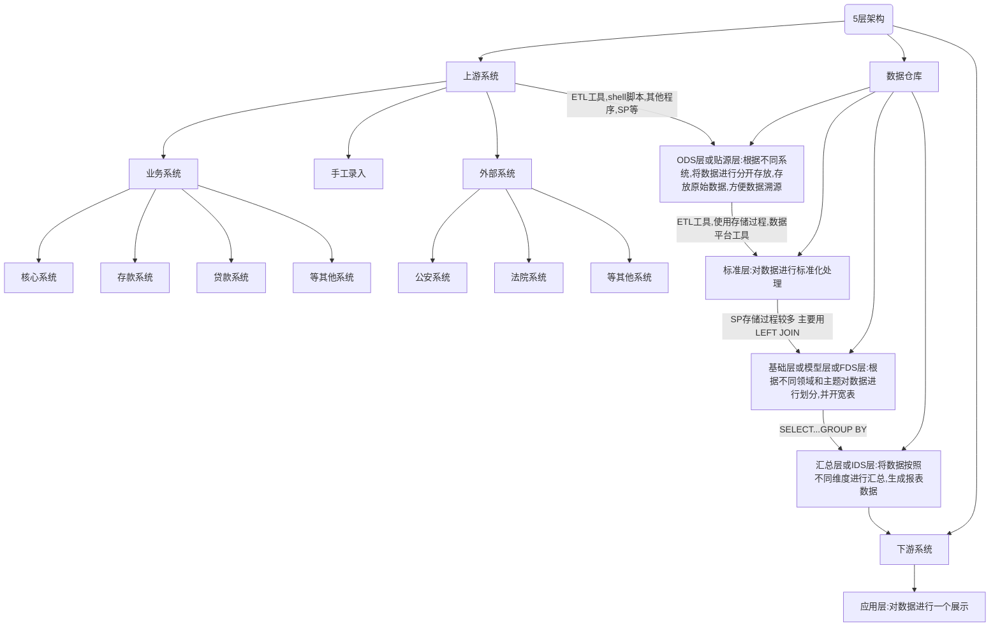
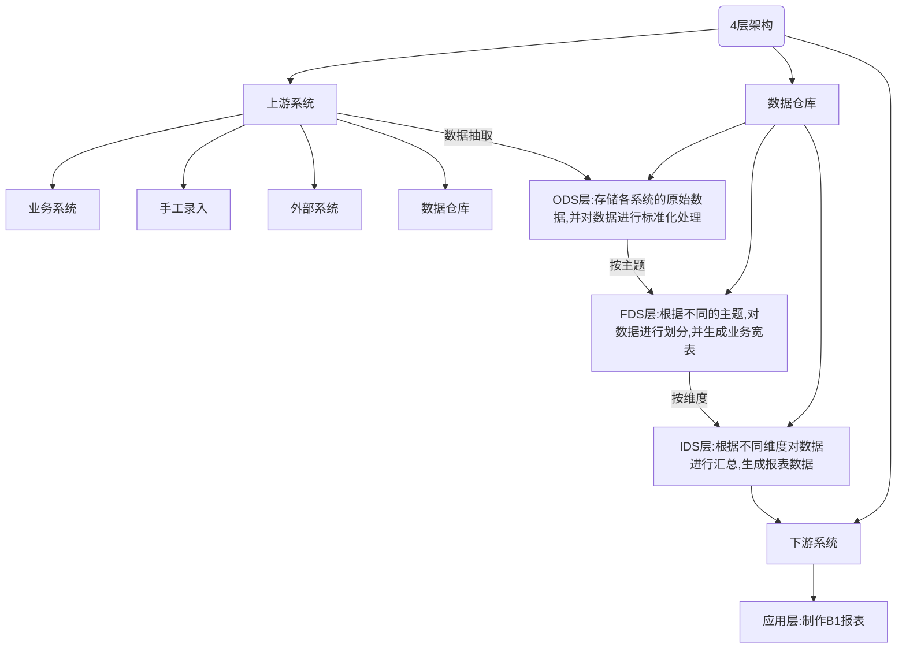

## 1.数据仓库概念及特点

**数据仓库**：数据仓库通常是一个**面向主题的、集成的、随时间变化的**、但信息本身**相对稳定**的数据集合，它用于对管理决策过程的支持。

**DW (Data Warehouse)数据仓库**，是数据的归宿，这里保持这所有的从源系统到来的数据，并长期保存，这些数据不会被修改。

**DM(Data Mart) 数据集市**，为了特定的应用目的或应用范围，而从数据仓库中独立出来的一部分数据，也可称为部门数据或主题数据。面向应用。

**主题**：用户使用数据仓库进行决策时所**关心的重点**方面，如：收入、客户、销售渠道等；所谓面向主题，是指**数据仓库**内的信息是**按主题**进行组织的，而不是像**业务支撑系统**那样是**按照业务功能**进行组织的。

**集成**：数据仓库中的信息不是从各个业务系统中简单抽取出来的，而是经过一系列加工、整理和汇总的过程，因此数据仓库中的信息是关于整个企业的一致的全局信息。

**随时间变化**：数据仓库内的信息并不只是反映企业当前的状态，而是记录了从过去某一时点到当前各个阶段的信息。通过这些信息，可以对企业的发展历程和未来趋势做出定量分析和预测。

**效率足够高**：数据仓库的分析数据一般分为日、周、月、季、年等，可以看出，日为周期的数据要求的效率最高，要求24小时甚至12小时内，目前普遍的数据展现方式为T+1，即当日处理昨日的业务数据。

**数据质量**：基于数据仓库的应用所面对的一般为企业决策层用户，所以对数据仓库提供的各种信息，肯定要准确的数据；但由于数据源有脏数据或者代码不严谨，所以数据仓库流程通常分为多个步骤，包括数据抽取，清洗，转换，装载，查询，展现等等；其中数据清洗则主要对抽取过来各数据源的脏数据和不规范数据进行统一标准化。

**扩展性**：有的大型数据仓库系统架构设计复杂，是因为考虑到了未来3-5年的扩展性，这样的话，未来不用花太多时间去重建数据仓库系统，就能很稳定运行。主要体现在数据建模的合理性，数据仓库方案中多出一些中间层，使海量数据流有足够的缓冲，不至于因为数据源的变动而导致用户应用功能的频繁变动。

### 1.银行主题

- **客户**：主要组织和存放与银行客户有关的信息。包括基本信息、地址信息、信用信息、黑名单信息、财务信息等。在客户主题域中以客户号为唯一识别，通过客户号与存款、贷款、银行卡、中间业务、渠道、公用主题进行关联。
- **存款**：组织和存储企业和个人客户的在银行的存款业务相关信息，主要包括账户信息、事件信息及事故信息。主要分为按个人活期、个人定期、企业活期、企业定期四个子主题。在存款主题域中以账号为唯一识别，通过账号与客户，中间业务、渠道、银行卡、公用主题进行关联。
- **贷款**：组织和存储客户的所有贷款业务数据。根据客户的性质，将贷款客户划分为企业贷款和个人贷款两类。在贷款主题域中以账号为唯一识别，通过账号与客户、公用主题进行关联。
- **银行卡**：组织和存储客户银行卡的基本信息和交易信息。在银行卡主题域中以卡号为唯一识别,通过卡号与存款、客户、渠道、公用。
- **中间业务**：主要整合银行除存、贷款业务以外的业务，即非利息收入以外的所有业务。中间业务主题逻辑划分按中间业务种类进行划分，如国内结算业务、银保通、证券基金、外汇买卖等业务相关信息。在中间业务主题域中以客户号、账号、产品、机构、渠道为唯一识别,分别通过客户号、账号、产品、机构、渠道与客户、存款、公用主题进行关联。
- **渠道**：主要存储渠道信息、签约账户信息、渠道账户信息以及交易流水信息。根据客户性质可将渠道数据分为企业客户和个人客户。在渠道主题域中以客户号、账号、产品、机构、渠道为唯一识别,分别通过客户号、账号、产品、机构、渠道与客户、存款、银行卡、公用主题进行关联。
- **总账**：组织和存储银行当前会计核算总账以及内部帐有关的信息。在总账主题域中以产品、机构为唯一识别,分别通过产品、机构与公用主题进行关联。
- **公共**：用于存储各种业务主题公用的一些信息。主要整合内部机构、人员、公共代码等相关信息。包括统一标准代码，以及标准代码与各个源系统代码的映射及人工补充代码。

### 2.维度度量

- **<u>维度</u>**是指一种视角，而不是一个固定的数字；是一个判断、说明、评价和确定一个事物的多方位、多角度、多层次的条件和概念。（参照group by后内容）

  在数据仓库的理论中，维度是一个与业务相关的观察角度，是依赖于数据的有效性和表达业务成效的关键性能指标。

- **<u>度量</u>**是业务量化的表示、用于评价业务状态的数值型数据、用于检测业务的成效，不同度量反映不同的业务性质，度量之间的相互独立的。（参照group by的AVG、MAX等）

- **<u>粒度</u>**是指保存数据的详细程度。

### 3.数据仓库与操作型数据库

**<u>数据仓库</u>**：面向主题，集成的，随时间变化的反应数据历史的数据集合

**<u>联机分析处理OLAP（On-Line Analytical Processing）</u>**：OLAP是数据仓库系统的主要应用，支持复杂的分析操作，侧重决策支持，并且提供直观易懂的查询结果。（一般用在数据仓库上，**<u>查询</u>**为主）

**<u>操作型数据库(业务数据库)</u>**：面向应用，详细的，可更新的，重复运行，事务驱动

**<u>联机事务处理OLTP（on-line transaction processing）</u>**：OLTP是传统的关系型数据库的主要应用，主要是基本的、日常的事务处理，例如银行交易。（一般用在业务上，业务系统数据库，**<u>增删改查</u>**，操作型）

| 差异项       | 数据库OLTP           | 数据仓库OLAP                |
| ------------ | -------------------- | --------------------------- |
| **特征**     | 操作处理             | 信息处理                    |
| **面向**     | 事务                 | 分析                        |
| **用户**     | DBA、开发            | 经理、主管、分析人员        |
| **功能**     | 日常操作             | 长期信息需求、决策支持      |
| **DB设计**   | 基于ER模型，面向应用 | **星形/雪花模型，面向主题** |
| **数据**     | 当前的、最新的       | 历史的、跨时间维护          |
| **汇总**     | 原始的、高度详细     | 汇总的、统一的              |
| **视图**     | 详细、一般关系       | 汇总的、多维的              |
| **工作单元** | 短的、简单事务       | 复杂查询                    |
| **访问**     | 读/写                | 大多为读                    |
| **关注**     | 数据进入             | 信息输出                    |
| **操作**     | 主键索引操作         | 大量的磁盘扫描              |
| **用户数**   | 数百到数亿           | 数百                        |
| **DB规模**   | GB到TB               | **>=TB PB EB**              |
| **优先**     | 高性能、高可用性     | 高灵活性                    |
| **度量**     | 事务吞吐量           | 查询吞吐量、响应时间        |

## 2.数据仓库的架构

### 0.1 5层架构

[5层架构.vsdx](https://service-li4lsb7w-1252530298.hk.apigw.tencentcs.com/release/OneManger/pic/ETL/5层架构.vsdx)

### 0.2 4层架构

实际工作中比较常见的，简单的数据架构

[4层架构.vsdx](https://service-li4lsb7w-1252530298.hk.apigw.tencentcs.com/release/OneManger/pic/ETL/4层架构.vsdx)

### 1.数据源，上游系统

1. 上游业务系统

   核心业务系统、对私（个人）信贷业务系统、中间业务系统、个人网银系统、对公信贷业务系统、ECIF（企业级客户信息整合系统）、信用卡系统、国际业务系统、公司网银系统、理财产品销售系统、银行卡收单系统、理财登记过户系统、二代支付系统、手机银行、电话银行系统、票据系统

2. 手工/人工录入

3. 外部系统

   公安系统、法院系统、征信系统

### 2.ODS层（导入层，贴源层，缓冲层）

> ODS层：操作型数据存储层，数仓中的可选部分，保存上游系统的原始数据，在业务系统和数仓之间形成隔离，保存原始细节数据，方便溯源（方便查找数据来源，比对原始数据）

上游系统到ODS层(ETL处理)：

1. 可以使用数据的导出，导入
2. 使用中间数据文件（由上游系统导出数据文件，再导入ODS层）
3. 使用ETL工具(Kettle,Informatic,datastage等)
4. Shell脚本

#### 1.ETL数据抽取方式：

##### 1.同步抽取和异步抽取

- 同步：由业务系统，用ETL工具(Kettle等)连接，使用SQL查询出数据，导入到数据仓库中（ODS层）	业务数据库---ETL工具--->ODS
- 异步：由业务系统，导出数据文件(dmp文件,csv文件等)，传输到FTP服务器，通过FTP服务将文件传输到数仓，再进行导入    业务数据库(上传)---FTP服务器--->数仓服务器(下载)---导入ODS

##### 2.全量抽取和增量抽取

- 全量抽取：全量抽取类似于**<u>数据迁移</u>**或数据复制，它将数据源中的表或视图的数据原封不动的从数据库中抽取出来，并转换成自己的ETL工具可以识别的格式。全量抽取比较简单。
- 增量抽取：增量抽取只抽取自上次抽取以后数据库中要抽取的表中新增或修改的数据。在ETL使用过程中，增量抽取较全量抽取应用更广。如何捕获变化的数据是增量抽取的关键。对捕获方法一般有两点要求：准确性，能够将业务系统中的变化数据按一定的频率准确地捕获到；性能，不能对业务系统造成太大的压力，影响现有业务。
  - 目前增量数据抽取中常用的捕获变化数据的方法有：触发器(一般不用)、时间戳

##### 3.抽取频率

抽取频率：从源系统获取数据的间隔

- T+1:按天抽取，每天抽取昨天的数据（最常用）

- M+1:按月抽取，每月初抽取上月数据

- Y+1:按年抽取，每年初抽取上一年数据

#### 2.抽取准确性方案

##### 1.触发器方式（又称快照式）

> 在要抽取的表上建立需要的触发器，一般要建立插入、修改、删除三个触发器，每当源表中的数据发生变化，就被相应的触发器将变化的数据写入一个临时表，抽取线程从临时表中抽取数据，临时表中抽取过的数据被标记或删除。

- **优点**：数据抽取的性能高，ETL加载规则简单，速度快，不需要修改业务系统表结构，可以实现数据的递增加载。
- **缺点**：要求业务表建立触发器，对业务系统有一定的影响。

##### 2.时间戳方式

> 它是一种基于快照比较的变化数据捕获方式，在源表上增加一个时间戳字段，系统中更新修改表数据的时候，同时修改时间戳字段的值。当进行数据抽取时，通过比较系统时间与时间戳字段的值来决定抽取哪些数据。

- **优点**：同触发器方式一样，时间戳方式的性能也比较好，ETL系统设计清晰，源数据抽取相对清楚简单，可以实现数据的递增加载。
-  **缺点**：时间戳维护需要由业务系统完成，对业务系统也有很大的倾入性（加入额外的时间戳字段），特别是对不支持时间戳的自动更新的数据库，无法捕获对时间戳以前数据的delete和update操作，在数据准确性上受到了一定的限制

##### 3.全表删除插入方式

> 每次ETL操作均删除目标表数据，由ETL全新加载数据。

- **优点**：ETL加载规则简单，速度快。
- **缺点**：对于维表加代理键不适应，当业务系统产生删除数据操作时，综合数据库将不会记录到所删除的历史数据，不可以实现数据的递增加载；同时对于目标表所建立的关联关系，需要重新进行创建。

##### 4.全表比对方式(常用)

> 全表比对的方式是采用MD5校验码，ETL工具事先为要抽取的表建立一个结构类似的MD5临时表，该临时表记录源表主键以及根据所有字段的数据计算出来的MD5校验码，每次进行数据抽取时，对源表和MD5临时表进行MD5校验码的比对，如有不同，进行Update操作，如目标表没有存在该主键值，表示该记录还没有，即进行Insert操作。

- **优点**：对已有系统表结构不产生影响，不需要修改业务操作程序，所有抽取规则由ETL完成，管理维护统一，可以实现数据的递增加载，没有风险。
- **缺点**：ETL比对较复杂，设计较为复杂，速度较慢。与触发器和时间戳方式中的主动通知不同，全表比对方式是被动的进行全表数据的比对，性能较差。当表中没有主键或唯一列且含有重复记录时，全表比对方式的准确性较差。

##### 5.日志表方式

> 在业务系统中添加系统日志表，当业务数据发生变化时，更新维护日志表内容，当作ETL加载时，通过读日志表数据决定加载那些数据及如何加载。

- **优点**：不需要修改业务系统表结构，源数据抽取清楚，速度较快。可以实现数据的递增加载。

- **缺点**：日志表维护需要由业务系统完成，需要对业务系统业务操作程序作修改，记录日志信息。日志表维护较为麻烦，对原有系统有较大影响。工作量较大，改动较大，有一定风险。

##### 6.日志方式(CDC)

> 通过分析数据库自身的日志来判断变化的数据。

- **优点**：提供了易于使用的API来设置CDC环境，缩短ETL的时间。不需要修改业务系统表结构，可以实现数据的递增加载。
- **缺点**：业务系统数据库版本与产品不统一，难以统一实现，实现过程相对复杂，并且需深入研究方能实现，CDC产品推出时间短，难免存在BUG。

> 注：CDC是一款比较老旧的读取数据库工具，只适合个别数据库。
>
> <u>现可使用OGG工具（OGG工具是从数据库日志中读取变化数据）</u>

#### 3.数据反抽

> 实现从ODS层反抽当日数据，将反抽的数据文件下发到下游系统中

### 3.标准层

> 对从各个不同源系统传入的，不统一，不合乎规范的数据进行标准化处理。
>
> **<u>(对ODS层的数据进行标准化处理。)</u>**

1. 去除/补全有缺失的数据

2. 去除/修改格式和内容错误数据（定义确定错误类型）

3. 去除/修改逻辑错误数据

4. 去除不需要的数据（重复数据）

5. 数据分割和拼接

6. 关联性验证

7. 添加时间戳

**ODS到标准层**：使用存储过程或ETL工具

### 4.基础层FDS

> 基础层、FDS层、模型层、集成层
>
> 基础层：根据业务线，将源数据进行集成加工，等到业务宽表（也叫事实表）

**标准层到基础层**：使用表连接

#### 数据库模型

##### 范式

关系数据库有六种范式：<u>第一范式（1NF）</u>、<u>第二范式（2NF）</u>、<u>第三范式（3NF）</u>、<u>巴斯-科德范式（BCNF）</u>、<u>第四范式(4NF）</u>、<u>第五范式（5NF，又称完美范式）</u>。

1NF：每一个列都是**<u>原子列</u>**，每个列不能再分(如国、省、市、区不符合，区与区...)。

2NF：列的**<u>唯一性</u>**，必须要建立有主键(满足第二范式（2NF）必须先满足第一范式（1NF）。

3NF：**<u>不能存在传递的依赖</u>**，不能通过非主键列查询到其他列的信息(如只能通过ID查询其他信息，不能通过age查询name)。

##### 星型模型

> 是一种多维的数据关系，它由一个事实表和一组维表组成。每个维表都有一个维作为主键，所有这些维的主键组合成事实表的主键。强调的是对维度进行预处理，将多个维度集合到一个事实表，形成一个**宽表**。
>
> 星型模型不符合关系数据库范式。

##### 雪花模型

> 是**对星型模型的扩展**。它对星型模型的维表进一步层次化，原有的各维表可能被扩展为小的事实表，形成一些局部的"层次"区域，这些被分解的表都连接到主维度表而不是事实表。雪花模型更加符合**<u>数据库范式</u>**，**减少数据冗余**，但是在分析数据的时候，**操作比较复杂，需要join的表比较多所以其性能并不一定比星型模型高**。

##### 两种模型对比

| 属性               | 星型模型 | 雪花模型           |
| ------------------ | -------- | ------------------ |
| **数据总量**       | **多**   | **少**             |
| **可读性**         | **容易** | **差**             |
| **表个数**         | **少**   | **多**             |
| **查询速度**       | **快**   | **慢**             |
| **冗余度**         | **高**   | **低**             |
| **对实时表的情况** | 增加宽度 | 字段比较少，冗余低 |
| **扩展性**         | 差       | 好                 |

##### 应用场景

**星型模型**的设计方式主要带来的好处是能够提升查询效率，因为生成的事实表已经经过预处理，主要的数据都在事实表里面，所以只要扫描实时表就能够进行大量的查询，而不必进行大量的join，其次维表数据一般比较少，在join可直接放入内存进行join以提升效率，除此之外，星型模型的事实表可读性比较好，不用关联多个表就能获取大部分核心信息，设计维护相对比较简单。**<u>数据仓库用的比较多。</u>**FDS层做的宽表基本都是星型模型。

**雪花模型**的设计方式是比较符合**<u>数据库范式</u>**的理念，设计方式比较正规，数据冗余少，但在查询的时候可能需要join多张表从而导致查询效率下降，此外规范化操作在后期维护比较复杂。**<u>业务系统用的比较多。</u>**

### 汇总层IDS层（主题层）

根据客户需求，将业务宽表的数据按照不同的主题（维度）进行汇总。(度量、指标)

**银行常用维度：**时间维，机构维和币种维等维度。

### 应用层

> 主要是对数仓数据的使用，主要有针对各种业务的BI报表开发，种数据应用平台，以及数仓对外提供的数据接口系统等

**应用层系统**：监管报送系统，绩效考核系统，成本分摊系统，风险数据集市，信贷报表，1104系统，市场与渠道分析，产品定价，驾驶舱，审计筛查等。

**商业智能（Business Intelligence，简称：BI），又称商业智慧或商务智能**，指用现代数据仓库技术、线上分析处理技术、数据挖掘和数据展现技术进行数据分析以实现商业价值。

**1104系统**：2003年11月4号银监会提出的“银行金融机构监管信息系统”。

