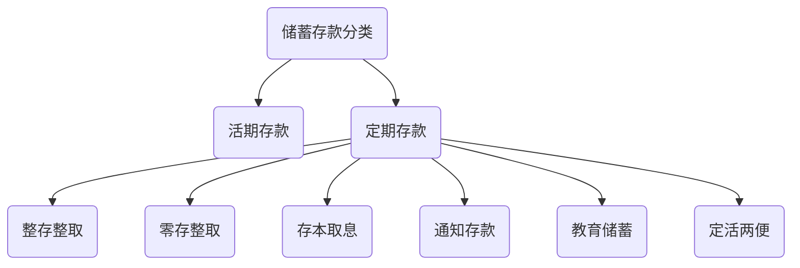

### 银行业务

#### 存款业务

#### 个人存款

##### 人民币存款

###### 活期储蓄

- 活期储蓄指不规定存期、客户可随时存取、存取金额不限，并可实现**<u>通存通兑</u>**的一种个人储蓄方式。
- 活期存款起存金额为一元，个人活期存款按季结息，按结息日挂牌活期利率计息。不到结息日清户时，按清户日挂牌公告的活期利率计算到清户前一日止。

###### 定期存款

> ​		定期储蓄是您在存款开户时约定存期，一次或按期分次(在约定存期内)存入本金，整笔或分期、分次支取本金或利息的一种储蓄方式。
>
> ​		个人定期储蓄可分为以下几种类型：整存整取、零存整取、存本取息、教育储蓄、定活两便和通知存款。定期存款中，只有<u>整存整取</u>可办理一次部分提前支取，其它储种只能办理全部提前支取。

- 整存整取
  - 开户时约定存期、整笔存入，到期一次整笔支取本息的一种个人存款。
  - 人民币50元起存，外汇整存整取存款起存金额为等值人民币100的外汇。
  - 存期分为3个月、半年、1年、2年、3年、5年。
  - 整存整取可办理一次部分提前支取。

- 零存整取
  - 开户时约定存期、分次每月固定存款金额(由您自定)、到期一次支取本息的一种个人存款。
  - 50元起存。存期分为一年、三年、五年。利息按存款开户日挂牌零存整取利率计算，到期未支取部分或提前支取按支取日挂牌的活期利率计算利息。

- 存本取息
  - 在存款开户时约定存期、整笔一次存入，按固定期限分次支取利息，到期一次支取本金的一种个人存款。
  - 一般是5000元起存。可一个月或几个月取息-次。存期分一年、三年、五年。
  - 利息按存款开户日挂牌存本取息利率计算到期未支取部分或提前支取按支取日挂牌的活期利率计息。

- 通知存款
  - 在存入款项时不约定存期，支取时事先通知银行，约定支取存款日期和金额的一种个人存款方式。
  - 最低起存金额为人民币五万元(含)。
  - 按存款人选择的提前通知的期限长短划分为一天通知存款和七天通知存款。其中一天通知存款需要提前一天向银行发出支取通知，并且存期最少需二天；七天通知存款需要提前七天向银行发出支取通知，并且存期最少需七天。

- 教育储蓄

  - 为鼓励城乡居民以储蓄方式，为其子女接受非义务教育积蓄资金，促进教育事业发展而开办的储蓄。其对象为在校小学四年级(含四年级)以上学生。

  - 存期分为一年、三年和六年三种。每一账户起存50元，本金合计最高限额为2万元。

  - 凭学校提供的正在接受非义务教育的学生身份证明一次支取本金和利息时，可以享受利

    率优惠，并免征储蓄存款利息所得税。

- 定活两便
  - 存款开户时不必约定存期，银行根据客户存款的实际存期按规定计息，可随时支取的一种个人存款种类。
  - 起存金额50元，存期不足三个月的，利息按支取日挂牌活期利率计算；存期三个月至半年的，利息按支取日挂牌整存整取三个月存款利率打六折计算；存期半年至一年的，整个存期按支取日定期整存整取半年期存款利率打六折计息；存期一年以上(含-年)无论存期多长，整个存期一律按支取日整存整取一年期存款利率打六折计息。

##### 外币存款

###### 外币存款按<u>存款人</u>不同可分为：

- **<u>乙种外币存款：</u>**外国人、外籍华人、华侨、港澳台同胞开立的存款账户。开立乙种外币存款账户时，须凭其护照或其他有效身份证件办理。
- **<u>丙种外币存款</u>**：是中国境内居民以本人名义开立外币存款账户，包括归侨、侨眷和港澳台同胞的亲属。

###### 外币存款按<u>钞汇</u>不同可分为：

- **<u>现钞户</u>**：现钞主要指的是由境外携入或个人持有的可自由兑换的外国货币，简单地说就是指个人所持有的外国钞票，如美元、日元、英镑等。
- **<u>现汇户</u>**：现汇是指由国外汇入或由境外携入、寄入的外币票据和凭证，在我们日常生活中能够经常接触到的主要有境外汇款和旅行支票等。

外币活期储蓄存款：外币活期储蓄存款是指不规定存期，客户不需预先通知银行，以各币种外币随时存取款，存取金额不限的一种储蓄业务。

外币定期储蓄存款：外币整存整取定期储蓄存款是指储户事先约定存期，以外币一次存入，到期后一次性支取本息的定期储蓄存款方式。

外币存款币种：币种主要有美元，欧元、港币、日元、英镑、加拿大元、瑞士法郎、澳大利亚元等。

对公存款

