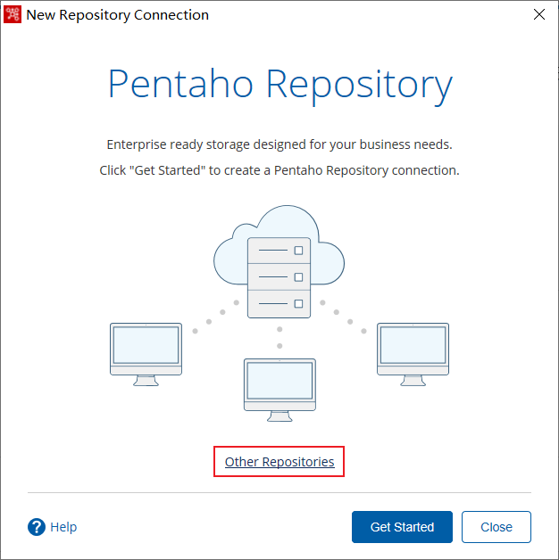

### PowerDesigner模型

1. 概念模型：设计数据库中都有哪些表，以及表和表之间如何关联。
2. 逻辑模型：表中存储的字段信息，字段一般以汉字方式保存字段的含义，并画出表之间的关系。表用实体表示
3. 物理模型：在逻辑模型的基础上去给表中的每一个字段创建英文名(实际的列名)。

### Kettle

#### 资源库

1. 在线资源库
2. 数据库资源库(不能实现跨资源操作)
3. 文件资源库

##### 数据库资源库

创建kettle用户连接

```SQL
/*查看表空间路径*/
select * from dba_data_files;
/*创建表空间*/
create tablespace ktspace datafile '/u01/app/oracle/oradata/orcl/ktspace.dbf' size 1G autoextend on next 100M maxsize unlimited;
/*创建临时表空间*/
create temporary tablespace kttemp tempfile '/u01/app/oracle/oradata/orcl/kttemp.dbf' size 1G autoextend on next 100M maxsize unlimited;
/*创建kettle用户并指定表空间及临时表空间*/
create user kettle default tablespace ktspace temporary tablespace kttemp identified by 123456;
/*授予kettle用户连接、资源角色*/
grant connect,resource to kettle;
```

创建kettle数据库资源库连接


##### 文件资源库


#### 转换：

> 用来抽取处理作业的
>
> .ktr后缀


#### 作业

> 用来调度
>
> .kjb后缀

数据库文件

> .kdb后缀

#### spoon命令

spoon图形化界面

Windows:spoon.bat

Linux:spoon.sh

#### kitchen命令

kitchen命令用来执行kettle中的作业

/rep参数:配置资源库例:文件类资源库配置资源库名称kt	/rep kt

/user参数:配置资源库用户	只用在数据库资源

/pass参数:配置资源库的用户密码	只在使用数据库资源库时使用

/job参数:配置作业名称

/logfile参数:配置日志文件路径

/level参数:配置日志级别

```
Kitchen.bat /rep kt /job job /1ogfi1e e: \Desktop\job.log
```

#### pan命令

pan命令:用来执行kettle中的转换的

/rep参数:配置资源库

/user参数:配置资源库用户	只在数据库资源中使用

/pass参数:配置资源库用户密码	只在数据库资源中使用

/trans参数:配置转换的名称

/level参数:配置日志级别

/logfile参数:配置日志文件路径

### FineReport帆软报表

#### 一些参数

```
$$$表示当前单元格的值
${自定义的参数名} 自定义参数
```

#### 坐标

##### 纵向坐标

###### 相对坐标：

- A1[A1:-1] :表示取A1单元格扩展出来的值的上一个值 1可以是任何的自然数据
- A1[A1:+1] :表示取A1单元格扩展出来的值的下一个值 1可以是任何自然数据

###### 绝对坐标

- A1[A1:1] :表示A1单元格扩展出来的第1个值 1可以是任何自然数据
- A1[A1:!-1]:表示取A1单元格扩展出来的最后一个值 1可以是任意自然数据

> A1表示取该列的值
> [A1]可以是其他单元格

##### 横向坐标

###### 相对坐标

- A1[;A1:-1]:横向相对坐标向前偏移
- A1[;A1:+1]:向后偏移

###### 绝对坐标

- A1[;A1:!-1]:取最后一个值
- A1[;A1:1]:取第几个


> 常用概念
>
> - 同比：也叫做同期比，今年4月和上年4月比较
>
>   - 同比公式
>
>   - ```
>     #A2为年份列 C2为金额
>     #如果A2单元格扩展出>1，取C2/C2相当于与A2(年)列的前1条数据，如果不>1，返回值为0
>     IF(&A2>1,C2/C2[A2:-1],0)
>     ```
>
> - 占比：当前值占总值的百分比
>
>   - 占比公式
>
>   - ```
>     #C2为金额
>     #返回C2列扩展出的所有值放到1个单元格中
>     C2[!0]
>     #C2当前值/C2扩展出的所有列的值的和 所有值
>     C2/SUM(C2[!0])
>     #按年份分组(本年内占比) A2为年份 {A2=$A2}筛选年份为当前年份
>     C2/SUM(C2[!0]{A2=$A2})
>     ```
>
> - 环比：当前值和上一个值的比例，今天的数据比昨天的数据
>
>   - 环比公式
>
>   - ```
>     #B2为月份列 C2为金额
>     #如果B2单元格扩展出>1，取C2/C2相当于B2(月)列的前1条数据，如果不>1，返回值为0
>     IF(&B2>1,C2/C2[B2:-1],0)
>     ```
>
> - 累计：
>
>   - 逐层累计:分组累积求和  月份：每月从头到月末
>
>     - ```
>       #C2为金额 B2为月份 G2为逐层累计金额 本月C2金额+上月的累计的金额=截止当前月的累计值
>       C2+G2[B2:-1]
>       ```
>
>   - 跨层累计:将数据进行累积求和(不分组)  月份：第2个月1日加上上个月月末的累加值。不分月分组
>
>     - ```
>       A2为年份 B2为月份 C2为金额 H2为跨层累计金额 
>       IF(&A2>1,IF(&B2>1,C2+H2[B2:!-1],C2+H2[A2:-1,B2:!-1]),C2+H2[B2:-1])
>       IF(&B2>1,C2+H2[B2:!-1],C2+H2[A2:-1,B2:!-1])
>       ```

#### 序号

&A2或SEQ()

> A2分组
>
> ```
> &B2会按分组加序号
> SEQ()不会按分组加序号整体加序号
> SEQ(A2)会按分组加序号
> ```

#### 分页

```
#条件属性-分页
#8条数据一页
&A2 % 8 == 0
```

