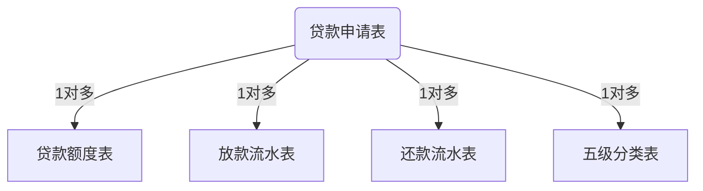

创建sdb用户及表空间、临时表空间

```SQL
/*sqlplus登录dba*/
sqlplus / as sysdba 
/*查看表空间路径*/
select * from dba_data_files;
/*创建表空间*/
create tablespace sdbdate datafile '/u01/app/oracle/oradata/orcl/sdbdata.dbf' size 1G autoextend on next 100M maxsize unlimited;
/*创建临时表空间*/
create temporary tablespace sdbtemp tempfile '/u01/app/oracle/oradata/orcl/sdbtemp.dbf' size 1G autoextend on next 100M maxsize unlimited;
/*创建kettle用户并指定表空间及临时表空间*/
create user sdb default tablespace sdbdate temporary tablespace sdbtemp identified by sdb;
/*授予kettle用户连接、资源角色*/
grant connect,resource to sdb;
```

一些查询语句

```SQL
/*查询数据库字符集*/
SELECT * FROM NLS_DATABASE_PARAMETERS;
/*查询客户端环境字符集*/
SELECT USERENV('LANGUAGE') FROM DUAL;
/*日期格式转为YYYYMMDD*/
alter session set NLS_DATE_FORMAT='YYYYMMDD';
/*查询用户下所有表名*/
SELECT TABLE_NAME FROM USER_TABLES;
/*查看数据库配置信息*/
select * from nls_database_parameters;
/*查询table_name表所有列名*/
select column_name from user_tab_cols where table_name='table_name' order by column_id;
/*查询所有列名，以逗号隔开*/
select listagg(column_name,',') within group(order by column_id) from user_tab_cols where table_name='LN_LNP_ACCT_AMWKPL06';
```


导入数据

cmd输入

```
imp system/sys@192.168.134.11:1521/orcl file=C:\Users\MyPC\Desktop\ETL\IN-OUT\exp_sdb.dmp fromuser=sdb touser=sdb ignore=y indexes=n log=C:\Users\MyPC\Desktop\ETL\IN-OUT\imp.log
```

​		附件：[exp_sdb.dmp](https://od.nulla.icu/pic/ETL/exp_sdb.dmp)

创建ODS层用户及表空间

```SQL
/*sqlplus登录dba*/
sqlplus / as sysdba
/*查看表空间路径*/
select * from dba_data_files;
/*创建表空间*/
create tablespace odsdate datafile '/u01/app/oracle/oradata/orcl/odsdata.dbf' size 1G autoextend on next 100M maxsize unlimited;
/*创建临时表空间*/
create temporary tablespace odstemp tempfile '/u01/app/oracle/oradata/orcl/odstemp.dbf' size 1G autoextend on next 100M maxsize unlimited;
/*创建kettle用户并指定表空间及临时表空间*/
create user ods default tablespace odsdate temporary tablespace odstemp identified by ods;
/*授予kettle用户连接、资源角色*/
grant connect,resource to ods;
```


创建ETL日志表

```SQL
/*
抽取的日期
模块名:LN
抽取状态:未抽取,已抽取,重抽
抽取时间:开始时间，结束时间
*/
CREATE TABLE ETL_LOG (
  DT DATE, --抽取数据的日期
  MODULE_NAME VARCHAR2(30), -- 抽取的模块
  STATUS VARCHAR2(1), -- 0表示未抽取 1表示已抽取 2表示重抽
  START_TIME DATE, -- 抽取开始时间
  END_TIME DATE --抽取完成时间
);
```


spool导出数据

shell脚本

```SHELL
#!/bin/sh
sqlplus -S sdb/sdb <<EOF
set heading off
set feedback off
set pagesize 0
set linesize 10000
set verify off
set trim on
set timeout off
set echo off
set trimspool on
set colsep ','
alter session set NLS_DATE_FORMAT='YYYYMMDD';
spool /home/oracle/LN_LNP_ACCT_AMWKPL06.dat
select * from LN_LNP_ACCT_AMWKPL06 where datadate='20210202';
spool off
exit
EOF
```


sqlldr控制文件

```SQL
load data
CHARACTERSET AL32UTF8
insert into table O_LN_LNP_ACCT_AMWKPL06
fields terminated by ','
trailing nullcols(
RT_CUST_NUM			"trim(:RT_CUST_NUM)",
TR_EXT_SEQ			"trim(:TR_EXT_SEQ)",
TR_EFF_DATE			"to_date(trim(:TR_EFF_DATE),'yyyymmdd')",
TR_TRAN_AMT			"trim(:TR_TRAN_AMT)",
TR_TOT_PRIN			"trim(:TR_TOT_PRIN)",
MI_PAY_ACCT_1		"trim(:MI_PAY_ACCT_1)",
TR_SYS_DATE			"to_date(trim(:TR_SYS_DATE),'yyyymmdd')",
TR_ENTRY_TIME		"trim(:TR_ENTRY_TIME)",
ETLDATE				"to_date(trim(:ETLDATE),'yyyymmdd')",
DATADATE			"to_date(trim(:DATADATE),'yyyymmdd')"
)
```

sqlldr执行

```SHELL
sqlldr ods/ods data=LN_LNP_ACCT_AMWKPL06.dat control=O_LN_LNP_CTRT_CBAPP.ctl rows=10000 skip=0 errors=100
```


使用shell脚本导入导出

配置ssh免密登录

```SHELL
#生成密钥 生成id_rsa(私钥)、id_rsa.pub(公钥)文件
ssh-keygen -t rsa
#拷贝密钥 生成authorized_keys(存储免密登录的公钥信息)、known_hosts(连接的主机信息)文件
ssh-copy-id -i ~/.ssh/id_rsa.pub oracle@oracle

#可使用sshpass传输密码登录
##安装sshpass
###CentOS
yum -y install sshpass
###Debian&Ubuntu
apt-get -y install sshpass
##ssh登录
sshpass -p 密码 ssh 用户@ip
###eg
sshpass -p password ssh user@localhost
```


环境变量

```SHELL
#!/bin/sh
##数据库用户名密码，数据库的地址
SDB_USER=sdb
SDB_PASSWORD=sdb
SDB_URL=192.168.134.11:1521/orcl

ODS_USER=ods
ODS_PASSWORD=ods
ODS_URL=192.168.134.11:1521/orcl
##导出数据 文件路径
EXP_DIR=/home/oracle
##导出数据条件ETL_LOG中的日期列
ETLDT=`sqlplus -S ${ODS_USER}/${ODS_PASSWORD} <<EOF
set heading off
set feedback off
set pagesize 0
set linesize 100
set verify off
set trim on
set echo off
SELECT TO_CHAR(MAX(DT),'YYYYMMDD') FROM ETL_LOG WHERE MODULE_NAME='LN' AND STATUS!='2';
exit
EOF`
#echo ${ETLDT}

##FTP服务器地址
FTP_URL=192.168.134.11
##FTP服务器用户名/密码
FTP_USER=oracle
FTP_PASSWORD=oracle
##FTP服务器路径
FTP_PATH=/home/oracle/FTP
##在FTP服务器上，创建信号文件
FLAG_FILE=LN_SUCCESS
```

导出上传FTP

```SHELL
#!/bin/sh
source ~/env.sh
##spool数据导出
sqlplus -S ${SDB_USER}/${SDB_PASSWORD} <<EOF
set heading off
set feedback off
set pagesize 0
set linesize 10000
set verify off
set trim on
set timeout off
set echo off
set trimspool on
set colsep ','
alter session set NLS_DATE_FORMAT='YYYYMMDD';
spool ${EXP_DIR}/LN_LNP_ACCT_AMWKPL06_${ETLDT}.dat
SELECT RT_CUST_NUM,TR_EXT_SEQ,TR_EFF_DATE,TR_TRAN_AMT,TR_TOT_PRIN,MI_PAY_ACCT_1,TR_SYS_DATE,TR_ENTRY_TIME,ETLDATE,DATADATE FROM LN_LNP_ACCT_AMWKPL06 WHERE TO_CHAR(DATADATE,'YYYYMMDD')='${ETLDT}';
spool off
exit
EOF

##将数据文件上传到FTP服务器
if sshpass -p oracle ssh ${FTP_USER}@${FTP_URL} test -e ${FTP_PATH}/${ETLDT};then
   sshpass -p oracle ssh ${FTP_USER}@${FTP_URL} "rm -rf ${FTP_PATH}/${ETLDT}/*"
else
   sshpass -p oracle ssh ${FTP_USER}@${FTP_URL} "mkdir ${FTP_PATH}/${ETLDT}"
fi

#SFTP上传到服务器
sftp ${FTP_USER}@${FTP_URL} <<EOF
put ${EXP_DIR}/LN_LNP_ACCT_AMWKPL06_${ETLDT}.dat ${FTP_PATH}/${ETLDT}/
put ${EXP_DIR}/LN_SUCCESS ${FTP_PATH}/${ETLDT}/
exit
EOF
```


生成导出脚本

```SHELL
#!/bin/sh
#查询出当前用户下的所有表的名称
tabs=`sqlplus -S sdb/sdb <<EOF
set heading off
set feedback off
set echo off
set verify off
set trim on
set pagesize 0
set linesize 100
select table_name from user_tables where table_name!='ETL_LOG';
exit
EOF`
#查询表中的列
cols=`sqlplus -S sdb/sdb <<EOF
set heading off
set feedback off
set echo off
set verify off
set pagesize 0
set linesize 10000
select listagg(column_name,',') within group(order by column_id) from user_tab_cols where table_name='${tab}';
exit
EOF`

for tab in $tabs
do
	#声名一个变量保存脚本名称
	script_name=/home/oracle/exp_script/exp_${tab}.sh
		echo "#!/bin/sh" > ${script_name}
		echo "source ./env.sh" >> ${script_name}
		echo "#spool数据导出" >> ${script_name}
		echo 'sqlplus -S ${SDB_USER}/${SDB_PASSWORD} <<EOF' >> ${script_name}
		echo "set heading off" >> ${script_name}
		echo "set feedback off" >> ${script_name}
		echo "set verify off" >> ${script_name}
		echo "set echo off" >> ${script_name}
		echo "set pagesize 0" >> ${script_name}
		echo "set linesize 10000" >> ${script_name}
		echo "set trimspool on" >> ${script_name}
		echo "set trim on" >> ${script_name}
		echo "set colsep ','" >> ${script_name}
		echo "ALTER SESSION SET NLS_DATE_FORMAT='yyyyMMdd';" >> ${script_name}
		echo 'spool ${EXP_DIR}/'${tab}'_${ETLDT}.dat' >> ${script_name}
	V_SQL='SELECT '${cols}' FROM '${tab}' WHERE TO_CHAR(DATADATE,'"'yyyyMMdd')='"'${ETLDT}'"';"
		echo $V_SQL >> ${script_name}
		echo 'spool off' >> ${script_name}
		echo 'exit' >> ${script_name}
		echo 'EOF' >> ${script_name}
		echo 'sftp ${FTP_USER}@${FTP_URL} <<EOF' >> ${script_name}
		echo 'put ${EXP_DIR}/'${tab}'_${ETLDT}.dat ${FTP_PATH}/${ETLDT}/' >>${script_name}
		echo 'exit' >> ${script_name}
		echo 'EOF' >> ${script_name}
done
```


贷款申请表(LN_LNP_CTRT_CBAPP)：贷款账号、ECIF客户号   贷前

贷款额度表(LN_LNP_CUST_CBCREDCUST)：ECIF客户号，包含多个额度(担保额度、保证额度、抵押额度、质押额度、信用额度)、额度期限

贷款放款流水表(LN_LNP_ACCT_AMWKPL06)：贷款账号、放款金额、期次贷款余额

还款流水表(LN_LNP_ACCT_AMWKPL07)：贷款账号

贷款五级分类表(LN_LNP_MNG_CFLLSTCHGRISKFLAG记录贷款状态的变更)：贷款账号、贷款状态、五级分类(贷款的新的状态)、调整日期




创建FDS用户及表空间

```SQL
/*sqlplus登录dba*/
sqlplus / as sysdba 
/*查看表空间路径*/
select * from dba_data_files;
/*创建表空间*/
create tablespace fdsdate datafile '/u01/app/oracle/oradata/orcl/fdsdata.dbf' size 1G autoextend on next 100M maxsize unlimited;
/*创建临时表空间*/
create temporary tablespace fdstemp tempfile '/u01/app/oracle/oradata/orcl/fdstemp.dbf' size 1G autoextend on next 100M maxsize unlimited;
/*创建kettle用户并指定表空间及临时表空间*/
create user fds default tablespace fdsdate temporary tablespace fdstemp identified by fds;
/*授予kettle用户连接、资源角色*/
grant connect,resource to fds;
```

FDS访问ODS数据库

dblink

使用sysdba创建，连接名(odb)不能和用户名(ods)冲突

```SQL
-- Create database link 
create public database link ODB
  connect to ODS identified by ods
  using '(DESCRIPTION =
    (ADDRESS = (PROTOCOL = TCP)(HOST = 192.168.134.11)(PORT = 1521))
    (CONNECT_DATA =
      (SERVER = DEDICATED)
      (SERVICE_NAME = orcl)
    )
  )';
```


dblink的使用

```SQL
/*表名@连接名*/
select  * from ETL_LOG@ODB;
```

给用户赋权限

```SQL
grant select any table to fds;  --sysdba执行
grant select on table_name to fds;
SELECT * FROM ods.table_name;
```


码值转换，存储过程、存储函数

```SQL
CREATE OR REPLACE FUNCTION F_MZ(V_CODE VARCHAR2,V_TYPE VARCHAR2)
RETURN VARCHAR2
IS
  V_NAME VARCHAR2(100);
BEGIN
  SELECT CODE_NAME INTO V_NAME FROM O_LN_MZ WHERE CODE=V_CODE AND M_TYPE=V_TYPE;
  RETURN V_NAME;
END;

SELECT F_MZ('CNY','币种类型') FROM DUAL;
```

存储过程格式

```SQL
CREATE OR REPLACE PROCEDURE SP_DEMO 
IS
  /*****************************************************************************
     程序名称：
     功能描述：
     输入参数：
     输出参数：
     返 回 值：
     目 标 表：
     源    表：
     创 建 人：
     创建日期：
     修改日期：
     修改人员：
     修改原因：
  ******************************************************************************/

  /*存储过程变量定义*/

  /* 程序开始执行*/
BEGIN

  /*存储过程变量赋值*/

  --删除目标表数据

  --插入数据

  /* 异常处理 */
  
END;
```

创建日志表

```SQL
CREATE TABLE F_SP_LOG (
  MNAME VARCHAR2 (30),-- 模块名称
  SPNAME VARCHAR2 (30),-- 存储过程名
  SQL_CODE VARCHAR2 (50),-- 错误编码
  SQL_ERRM VARCHAR2 (200),-- 错误信息
  STARTDATE DATE,--运行时间
  ENDDATE DATE, --结束时间
  SQLNUM NUMBER(11), -- 数据条数
  LOGTY VARCHAR2 (30) --日志状态
);
```

创建存储过程保存日志信息

```SQL
CREATE OR REPLACE PROCEDURE SP_F_WRITE_LOG(V_MNAME     VARCHAR2,
                                           V_SPNAME    VARCHAR2,
                                           V_SQL_CODE  VARCHAR2,
                                           V_SQL_ERRM  VARCHAR2,
                                           V_STARTDATE DATE,
                                           V_ENDDATE   DATE,
                                           V_SQLNUM    NUMBER,
                                           V_LOGTY     VARCHAR2) 
IS
BEGIN
  INSERT INTO F_SP_LOG
  VALUES
    (V_MNAME,
     V_SPNAME,
     V_SQL_CODE,
     V_SQL_ERRM,
     V_STARTDATE,
     V_ENDDATE,
     V_SQLNUM,
     V_LOGTY);
     COMMIT;
END;
```

存储过程生成宽表数据

```SQL
CREATE OR REPLACE PROCEDURE SP_LN_LOAN_INFO(ETLDT DATE)
IS
  /*****************************************************************************
     程序名称：SP_LN_LOAN_INFO
     功能描述：根据需求生成贷款宽表数据
     输入参数：ETLDT  --运行的日期参数
     输出参数：无
     返 回 值：无
     目 标 表：F_LN_LOAN_INFO                       --贷款宽表
     源    表：
               ODS.O_LN_LNP_ACCT_AMWKPL06            --放款流水表
               ODS.O_LN_LNP_ACCT_AMWKPL07            --还款流水表
               ODS.O_LN_LNP_CTRT_CBAPP               --贷款申请表
               ODS.O_LN_LNP_CUST_CBCREDCUST          --额度表
               ODS.O_LN_LNP_MNG_CFLLSTCHGRISKFLAG  --五级分类表
               ODS.O_LN_MZ                           --码值表
     创 建 人：
     创建日期：20220419
     修改日期：
     修改人员：
     修改原因：
  ******************************************************************************/

  /*存储过程变量定义*/
  M_NAME VARCHAR2(30);   --用来保存该存储过程属于哪个模块或主题
  SP_NAME VARCHAR2(30);  --用来保存存储过程名
  START_TIME DATE;  --保存存储过程运行时间
  END_TIME DATE;    --存储过程的结束时间
  N INTEGER;             --存储过程处理的数据条数
  SP_STATUS VARCHAR2(10);--保存存储过程的运行状态 正常，异常
  SQL_CODE VARCHAR2(30); --保存异常的编码
  SQL_ERRM VARCHAR2(200);--保存异常信息
  
  V_SQL VARCHAR2(2000);  --用来保存SQL语句 动态SQL execute immediate ''
  /* 程序开始执行*/
BEGIN

  /*存储过程变量赋值*/
  M_NAME:='LOAN';
  SP_NAME:='SP_LN_LOAN_INFO';
  START_TIME:=SYSDATE;
  --设置会话的日期格式 ALTER SESSION SET NLS_DATE_FORMAT='YYYYMMDD';
  EXECUTE IMMEDIATE 'ALTER SESSION SET NLS_DATE_FORMAT=''YYYYMMDD''';
  --删除目标表数据
  DELETE FROM F_LN_LOAN_INFO WHERE ETLDATE=ETLDT;
  --插入数据  INSERT INTO SELECT   MERDE INTO 语句
  INSERT INTO F_LN_LOAN_INFO
  SELECT 
    LN.LOANACNO,
    LN.ECIF_CUST_NO,
    LN.CURRSIGN,
    F_MZ(LN.CURRSIGN,'币种类型') CURRSIGNNAME,
    LN.CUSTNAME,
    LN.LOANKIND,
    F_MZ(LN.LOANKIND,'贷款种类') LOANKINDNAME,
    LN.FUNDSOUR,
    F_MZ(LN.FUNDSOUR,'资金来源') FUNDSOURNAME,
    LN.LOANUSE,
    F_MZ(LN.LOANUSE,'贷款用途') LOANUSENAME,
    LN.ASSUKIND,
    F_MZ(LN.ASSUKIND,'担保方式') ASSUKINDNAME,
    LN.CONTDATE,
    LN.TCAPI,
    WJFL.ABAL,
    FK.SUM_TRAN_AMT,  --放款总额
    HK.SUM_REP_AMT,   --还款总额
    ED.CREDAMT,
    ED.ASSUAMT,
    ED.IMPAAMT,
    ED.MORTAMT,
    ED.CREDTOTALAMT,
    ED.CYCFLAG,
    ED.LEFTAMT,
    WJFL.NEWRISKFLAG,
    LN.THISTCAPI,
    LN.TERMFREQ,
    LN.TTERM,
    LN.RETUTYPE,
    LN.TROTHDUEDAY,
    LN.FIXRATETERM,
    LN.FIRSTDUEDATE,
    LN.ISENOUSUBS,
    LN.RELEWAY,
    LN.PAYEEACNO,
    LN.PAYEEACNAME,
    LN.PAYEEBANKNAME,
    LN.INTEMETH,
    LN.AHEADDAYS,
    LN.BASICINTERATE,
    LN.INTERATE,
    LN.INTEFINERATEFLOAT,
    LN.CAPIFINERATEFLOAT,
    LN.FINERATE,
    LN.CAPIFINERATE,
    LN.FOULRATE,
    LN.EMBERATEFLOAT,
    LN.BEGINDATE,
    LN.ENDDATE,
    LN.CONTNO,
    LN.APPRNAME,
    LN.APPRTABNO,
    LN.APPRDATE,
    LN.APPRSTATE,
    LN.LOANSTATE,
    LN.DATADATE,
    LN.ETLDATE
  FROM O_LN_LNP_CTRT_CBAPP@ODB LN--贷款申请表
  LEFT JOIN --最新的五级分类
  --SELECT 贷款账号,ABAL,NEWRISKFLAG FROM (SELECT .*,ROW_NUMBER()OVER(PARTITION BY 贷款账号...ORDER BY...) N FROM 五级分类表) WHERE N=1
  (SELECT LOANACNO,
         ABAL,
         NEWRISKFLAG
    FROM (SELECT T1.LOANACNO,
                 T1.ABAL,
                 T1.NEWRISKFLAG,
                 ROW_NUMBER() OVER(PARTITION BY T1.LOANACNO ORDER BY T1.ASJUDATE DESC) N
            FROM O_LN_LNP_MNG_CFLLSTCHGRISKFLAG@ODB T1)
   WHERE N = 1) WJFL  --查询最新五级分类
   ON LN.LOANACNO=WJFL.LOANACNO
  LEFT JOIN --查询出放款总额
  --SELECT 贷款账号,SUM(放款金额) FROM 放款表 GROUP BY 贷款账号
  (SELECT RT_CUST_NUM,
         SUM(TR_TRAN_AMT) SUM_TRAN_AMT  --放款总金额
    FROM O_LN_LNP_ACCT_AMWKPL06@ODB
   GROUP BY RT_CUST_NUM) FK
   ON LN.LOANACNO=FK.RT_CUST_NUM
  LEFT JOIN  --查询还款总额
  --SELECT 贷款账号,SUM(应还本金+应还利息) FROM 还款表 GROUP BY 贷款账号 ON LN.LN_LOANACNO=HK.贷款账号
  (SELECT RT_ACCT_NUM,
         SUM(PRIN_PAY_AMT + INT_PAY_AMT) SUM_REP_AMT --还款总额
    FROM O_LN_LNP_ACCT_AMWKPL07@ODB
   GROUP BY RT_ACCT_NUM) HK
   ON LN.LOANACNO=HK.RT_ACCT_NUM 
  LEFT JOIN --客户额度信息
 --SELECT * FROM (SELECT .*,ROW_NUMBER()OVER(PARTITION BY 客户号 ORDER BY 日期 DESC) N FROM 额度表) WHERE N=1
  (SELECT 
      ECIF_CUST_NO,
      CREDAMT,
      ASSUAMT,
      IMPAAMT,
      MORTAMT,
      CREDTOTALAMT,
      CYCFLAG,
      LEFTAMT
   FROM (SELECT 
                T2.ECIF_CUST_NO,
                T2.CREDAMT,
                T2.ASSUAMT,
                T2.IMPAAMT,
                T2.MORTAMT,
                T2.CREDTOTALAMT,
                T2.CYCFLAG,
                T2.LEFTAMT,
                ROW_NUMBER()OVER(PARTITION BY ECIF_CUST_NO ORDER BY APPRDATE DESC) N 
           FROM O_LN_LNP_CUST_CBCREDCUST@ODB T2) 
  WHERE N=1) ED
  ON LN.ECIF_CUST_NO=ED.ECIF_CUST_NO
   
  WHERE ETLDATE=ETLDT;
  
  END_TIME:=SYSDATE;
  N:=SQL%ROWCOUNT;  --设置插入的数据条数
  SP_STATUS:='正常';
  COMMIT;
  --记录日志
  ---将日志进行保存(写入到文件中，写入到数据库中)
  SP_F_WRITE_LOG(M_NAME,SP_NAME,SQL_CODE,SQL_ERRM,START_TIME,END_TIME,N,SP_STATUS);
  /* 异常处理 */
  EXCEPTION
    WHEN OTHERS THEN
      ROLLBACK;
      /*记录异常日志*/
      END_TIME:=LOCALTIMESTAMP;
      SP_STATUS:='异常';
      SQL_CODE:=SQLCODE;
      SQL_ERRM:=SUBSTE(SQLERRM,1,200);
      --写日志
      SP_F_WRITE_LOG(M_NAME,SP_NAME,SQL_CODE,SQL_ERRM,START_TIME,END_TIME,N,SP_STATUS);
END;
/
```

